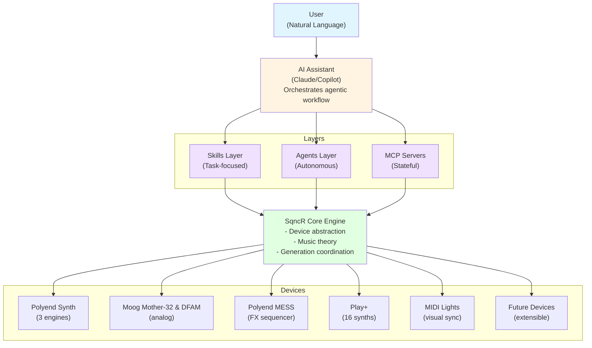
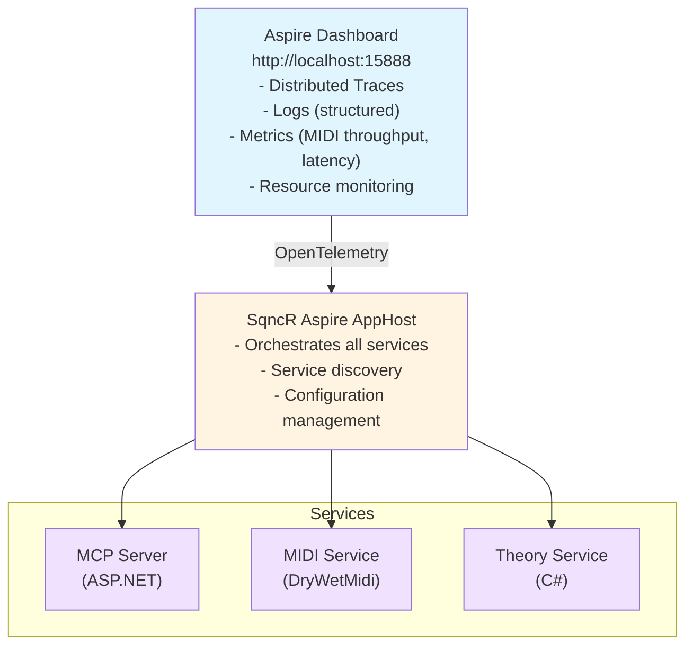

# SqncR Agentic Architecture - AI-First Music System

## Core Philosophy

**Device-Agnostic Experience First**
- Don't build for "Polyend" or "Moog" - build for **musical intent**
- Devices are implementations, not the architecture
- User says "give me a dark bass drone" - system figures out which device(s) to use
- Compositional intelligence layer sits above device layer

**Modern Agentic Stack**



---

## Layer 1: Skills (Discrete, Composable Tasks)

**Skills are single-purpose, stateless capabilities**

### Musical Skills

**skill-analyze-song**
```yaml
name: Analyze Song for Musical Recreation
description: Extracts key, chords, melody from song description or audio
inputs:
  - song_description: "that Cream song from The Breakfast Club"
  - reference_audio: optional URL or file
outputs:
  - key: string
  - tempo: number
  - chord_progression: array
  - melody_notes: array
  - vibe_tags: array
implementation: |
  1. Search for song metadata
  2. If audio available, analyze harmonically
  3. Return structured musical data
  4. SqncR core translates to MIDI
```

**skill-vibe-to-music**
```yaml
name: Translate Abstract Concept to Musical Parameters
description: Convert artistic/emotional concepts to music theory
inputs:
  - concept: "make it sound like Rothko"
  - current_musical_context: optional
outputs:
  - mode: string
  - harmonic_rhythm: string
  - chord_extensions: boolean
  - density: number (0-1)
  - parameter_adjustments: object
implementation: |
  1. Semantic analysis of concept
  2. Map to musical characteristics
  3. Return theory-based parameters
examples:
  - "Rothko" → slow, sustained, extended chords, Dorian/Phrygian
  - "Film noir" → chromatic, tension, dim7 chords
  - "Sunrise" → bright, major, rising melodic motion
```

**skill-chord-progression**
```yaml
name: Generate Chord Progression
description: Create harmonically sophisticated progressions
inputs:
  - key: string
  - mode: string
  - vibe: string (dark, bright, tense, resolved)
  - length: number (bars)
  - complexity: number (0-10)
outputs:
  - progression: array of chord objects
  - voice_leadings: array
  - tension_curve: array
implementation: |
  Uses music theory engine:
  - Functional harmony rules
  - Voice leading optimization
  - Tension/release curves
  - Modal interchange when appropriate
```

**skill-device-selector**
```yaml
name: Select Best Device for Role
description: Choose optimal device(s) for musical role
inputs:
  - role: bass|chords|pads|lead|drums|texture|fx
  - characteristics: array (warm, bright, analog, digital, etc)
  - available_devices: array
outputs:
  - selected_device: object
  - channel: number
  - configuration_suggestions: object
implementation: |
  1. Query device registry
  2. Match capabilities to requirements
  3. Consider voice availability
  4. Return best fit with reasoning
```

**skill-polyrhythm-generator**
```yaml
name: Generate Polyrhythmic Patterns
description: Create mathematically interesting rhythms
inputs:
  - base_tempo: number
  - time_signature: string
  - complexity: number (2-7 against base)
  - instruments: array
outputs:
  - patterns: array of rhythmic sequences
  - sync_points: array (where patterns align)
implementation: |
  - Calculate LCM of rhythm divisions
  - Generate patterns that align periodically
  - Assign to different voices/devices
```

### Device Control Skills

**skill-list-devices**
```yaml
name: List MIDI Devices
implementation: executable
path: ./skills/sqncr-list-devices.exe
outputs:
  - devices: array of MIDI device objects
```

**skill-send-midi**
```yaml
name: Send MIDI Message
implementation: executable
path: ./skills/sqncr-send-midi.exe
inputs:
  - device: string
  - channel: number
  - message_type: note_on|note_off|cc|program_change
  - data: object
```

**skill-configure-lights**
```yaml
name: Configure MIDI Light Show
description: Sync visual elements to musical parameters
inputs:
  - tempo: number
  - intensity: number (0-10)
  - color_mapping: object (harmonic → color)
outputs:
  - light_sequence: MIDI CC messages
implementation: |
  Maps musical events to MIDI CC for lighting:
  - Key changes → color shifts
  - Intensity → brightness
  - Tempo → strobe/pulse rate
```

---

## Layer 2: Agents (Autonomous, Stateful, Goal-Oriented)

**Agents maintain state and work toward goals**

### Core Agents

**agent-session-manager**
```yaml
name: Session Manager Agent
description: Maintains musical session state and coherence
responsibilities:
  - Track current key, tempo, mode, intensity
  - Remember instrument assignments
  - Maintain generation history
  - Ensure musical coherence across changes
state:
  - current_session: Session object
  - active_generators: array
  - musical_context: MusicContext object
  - device_allocations: DeviceRegistry
autonomy: |
  - Suggests key/mode changes for variety
  - Prevents jarring transitions
  - Manages voice allocation across devices
  - Auto-saves session snapshots
```

**agent-composition**
```yaml
name: Composition Agent
description: High-level compositional decisions
responsibilities:
  - Structure (intro, build, peak, resolution)
  - Orchestration (which devices when)
  - Harmonic journey (chord progressions)
  - Tension/release arcs
tools:
  - skill-chord-progression
  - skill-vibe-to-music
  - skill-device-selector
autonomy: |
  When user says "build this over 5 minutes":
  1. Creates structural timeline
  2. Plans intensity curve
  3. Schedules layer introductions
  4. Manages harmonic progression
  5. Executes autonomously, user can interrupt
```

**agent-listener**
```yaml
name: Listener Agent
description: Monitors MIDI input and adapts generation
responsibilities:
  - Real-time analysis of user's playing
  - Key/tempo/chord detection
  - Style analysis (staccato vs legato, etc)
  - Complementary generation
state:
  - detected_key: string
  - detected_tempo: number
  - user_voicing: array (what user is playing)
  - play_style: object
autonomy: |
  Continuously analyzes input:
  - Detects harmonic changes
  - Adjusts generation to complement
  - Avoids doubling user's notes
  - Responds to dynamic changes
```

**agent-device-orchestrator**
```yaml
name: Device Orchestrator Agent
description: Manages multiple devices as an ensemble
responsibilities:
  - Voice allocation across devices
  - Prevent conflicts (frequency masking)
  - Balance density and space
  - Coordinate complex multi-device patterns
state:
  - device_states: map of device → current usage
  - voice_allocation: map of role → device
  - frequency_map: spectrum usage tracking
autonomy: |
  - Automatically assigns roles to best devices
  - Rebalances when devices added/removed
  - Prevents voice stealing
  - Suggests device combinations
```

---

## Layer 3: MCP Servers (Stateful Services)

**MCP servers expose tools/resources, maintain long-running state**

### sqncr-core (Main MCP Server)

**Tools:**
```typescript
{
  // Session Management
  "sqncr.session.start": {
    description: "Start new music session",
    params: { preset?: string }
  },
  "sqncr.session.stop": {},
  "sqncr.session.save": { name: string },
  "sqncr.session.load": { name: string },
  "sqncr.session.state": {},
  
  // Generation Control
  "sqncr.generate.start": {
    description: "Start generating music",
    params: {
      description: string,  // natural language
      tempo?: number,
      key?: string,
      mode?: string,
      instruments?: array
    }
  },
  "sqncr.generate.modify": {
    description: "Modify active generation",
    params: { instruction: string }
  },
  "sqncr.generate.stop": {},
  
  // Device Management
  "sqncr.devices.list": {},
  "sqncr.devices.setup": {
    device: string,
    role: string,
    channels: object,
    description: string
  },
  "sqncr.devices.send_midi": {
    device: string,
    channel: number,
    messages: array
  },
  
  // Musical Intelligence
  "sqncr.music.analyze": {
    description: "Analyze song/reference",
    params: { song_description: string }
  },
  "sqncr.music.progression": {
    key: string,
    vibe: string,
    bars: number
  },
  
  // Listener Mode
  "sqncr.listen.start": {
    description: "Listen to user input and respond",
    params: { mode: "complement" | "follow" | "contrast" }
  },
  "sqncr.listen.stop": {}
}
```

**Resources:**
```typescript
{
  "sqncr://devices": "List of configured devices",
  "sqncr://session/current": "Current session state",
  "sqncr://session/history": "Session history",
  "sqncr://presets": "Saved presets/recipes"
}
```

### sqncr-theory (Music Theory MCP Server)

**Tools:**
```typescript
{
  "theory.scales.get": {
    key: string,
    mode: string
  },
  "theory.chords.generate": {
    key: string,
    quality: string,
    extensions: boolean
  },
  "theory.progression.create": {
    key: string,
    vibe: string,
    bars: number
  },
  "theory.voice_leading.compute": {
    chords: array,
    range: [number, number]
  },
  "theory.interval.analyze": {
    note1: number,
    note2: number
  }
}
```

### sqncr-devices (Device Registry MCP Server)

**Tools:**
```typescript
{
  "devices.scan": {},
  "devices.get": { id: string },
  "devices.capabilities": { id: string },
  "devices.profiles.list": {},
  "devices.profiles.load": { device_type: string }
}
```

**Resources:**
```typescript
{
  "devices://polyend-synth": "Polyend Synth profile",
  "devices://moog-mother32": "Moog Mother-32 profile",
  "devices://moog-dfam": "Moog DFAM profile",
  "devices://sonoclast-mafd": "Sonoclast MAFD profile",
  "devices://polyend-mess": "Polyend MESS profile",
  "devices://polyend-play": "Polyend Play+ profile"
}
```

---

## Device Abstraction Layer

**Every device has a profile defining capabilities**

```typescript
interface DeviceProfile {
  id: string
  name: string
  type: "synth" | "drum_machine" | "fx" | "sequencer" | "controller" | "light"
  
  midi: {
    channels: number[]  // which channels it responds to
    polyphony: number | "per_channel"
    capabilities: string[]  // ["note_on", "note_off", "cc", "aftertouch", "pitchbend"]
  }
  
  roles: string[]  // ["bass", "chords", "pads", "lead", "drums", "texture"]
  
  characteristics: {
    timbre: string[]  // ["warm", "bright", "analog", "digital", "clean", "distorted"]
    synthesis: string[]  // ["va", "fm", "wavetable", "granular", "sample"]
    range: [number, number]  // MIDI note range
  }
  
  // Optional: device-specific optimizations
  optimization?: {
    voice_allocation?: Function
    note_priority?: "low" | "high" | "last"
    special_features?: object
  }
}
```

### Example Device Profiles

**Polyend Synth**
```typescript
{
  id: "polyend-synth-001",
  name: "Polyend Synth",
  type: "synth",
  midi: {
    channels: [1, 2, 3],  // 3 engines
    polyphony: { total: 8, per_channel: "shared" },
    capabilities: ["note_on", "note_off", "cc", "aftertouch", "pitchbend"]
  },
  roles: ["bass", "chords", "pads", "lead", "texture"],
  characteristics: {
    timbre: ["versatile", "modern", "digital"],
    synthesis: ["wavetable", "granular", "fm", "va", "physical_modeling"],
    range: [0, 127]
  },
  optimization: {
    voice_allocation: polyendVoiceManager,
    multi_timbral: true,
    engines: 3
  }
}
```

**Moog Mother-32**
```typescript
{
  id: "moog-mother32-001",
  name: "Moog Mother-32",
  type: "synth",
  midi: {
    channels: [1],
    polyphony: 1,  // monophonic
    capabilities: ["note_on", "note_off", "cc", "pitchbend"]
  },
  roles: ["bass", "lead"],
  characteristics: {
    timbre: ["warm", "fat", "analog", "classic"],
    synthesis: ["va"],
    range: [0, 127]
  },
  optimization: {
    note_priority: "last",  // latest note wins
    cv_output: true  // can control other modular gear
  }
}
```

**Polyend MESS**
```typescript
{
  id: "polyend-mess-001",
  name: "Polyend MESS",
  type: "fx",
  midi: {
    channels: [1],  // configurable
    polyphony: 1,
    capabilities: ["cc", "program_change", "clock", "transport"]
  },
  roles: ["texture", "fx", "sequencer"],
  characteristics: {
    timbre: ["glitchy", "lofi", "degradation", "modulation", "delay", "reverb"],
    synthesis: ["multi_fx"],
    range: null  // FX pedal, no note range
  },
  optimization: {
    parameter_map: {
      // MIDI CC → effect parameter mappings (see manual page 21)
      // Assignable per preset
    },
    sequencer: {
      steps: 16,
      midi_controllable: true,
      clock_sync: true
    },
    presets: {
      midi_accessible: 127,  // PC 0-127
      total: "unlimited"  // but >127 not accessible via MIDI
    },
    limitations: [
      "Cannot engage/bypass effect via MIDI",
      "Presets >127 not accessible via MIDI PC"
    ]
  }
}
```

**Moog DFAM**
```typescript
{
  id: "moog-dfam-001",
  name: "Moog DFAM",
  type: "drum_machine",
  midi: {
    channels: [1],  // via MAFD adapter
    polyphony: 1,
    capabilities: ["note_on", "note_off", "velocity", "aftertouch"]
  },
  roles: ["drums", "percussion", "bass"],
  characteristics: {
    timbre: ["analog", "punchy", "aggressive", "modular"],
    synthesis: ["analog_percussion"],
    range: null  // 8-step sequencer triggered by MIDI via MAFD
  },
  optimization: {
    requires_adapter: {
      name: "Sonoclast MAFD",
      url: "https://sonoclast.com/products/mafd/",
      function: "MIDI-to-trigger conversion for DFAM's 8 steps"
    },
    note_priority: "last",
    step_mapping: "8 adjacent MIDI notes → 8 DFAM steps",
    cv_outputs: {
      velocity: "0-5V from MIDI velocity",
      pressure: "0-5V from aftertouch/mod wheel"
    }
  }
}
```

**Sonoclast MAFD** (MIDI Adapter for DFAM)
```typescript
{
  id: "sonoclast-mafd-001",
  name: "Sonoclast MAFD",
  type: "controller",
  midi: {
    channels: [1],  // configurable via firmware
    polyphony: 8,  // 8 DFAM steps
    capabilities: ["note_on", "note_off", "velocity", "aftertouch", "mod_wheel"]
  },
  roles: ["controller"],  // MIDI-to-CV bridge
  characteristics: {
    timbre: null,  // no sound generation
    synthesis: null,
    range: null
  },
  optimization: {
    controls_device: "Moog DFAM",
    inputs: ["USB MIDI", "DIN MIDI", "TRS MIDI Type B"],
    outputs: {
      "ADV/CLOCK": "Triggers DFAM step advancement",
      "VELOCITY OUT": "0-5V CV from MIDI velocity (0-127)",
      "PRESSURE OUT": "0-5V CV from aftertouch or mod wheel"
    },
    power: "USB or Eurorack +5V rail (45mA)",
    form_factor: ["2hp Eurorack", "Desktop case"],
    step_mapping: "8 adjacent MIDI notes map to 8 DFAM steps",
    url: "https://sonoclast.com/products/mafd/"
  }
}
```
```typescript
{
  id: "polyend-play-001",
  name: "Polyend Play+",
  type: "sampler",
  midi: {
    channels: [1, 2, 3, 4, 5, 6, 7, 8, 9, 10, 11, 12, 13, 14, 15, 16],
    polyphony: 128,  // per track/channel
    capabilities: ["note_on", "note_off", "cc", "program_change"]
  },
  roles: ["drums", "bass", "chords", "pads", "lead", "texture"],
  characteristics: {
    timbre: ["versatile", "sampled"],
    synthesis: ["sample_playback", "synthesis"],
    range: [0, 127]
  },
  optimization: {
    tracks: 16,
    internal_synths: 8,
    sample_slots: 128,
    built_in_sequencer: true
  }
}
```

---

## Agentic Workflow Examples

### Example 1: "Make it sound like Rothko"

**User says:** `"make it sound like Rothko"`

**AI Assistant orchestration:**
```
1. Calls skill-vibe-to-music
   → Returns: {
       mode: "dorian",
       harmonic_rhythm: "very_slow",
       chord_extensions: true,
       density: 0.2,
       timbre: "warm_blurred"
     }

2. Calls agent-composition.update_parameters(vibe_params)
   → Agent updates internal state

3. Calls sqncr.generate.modify
   → MCP server applies changes to active generators

4. Music transitions smoothly
```

### Example 2: "I want it to sound like that Cream song from The Breakfast Club"

**User says:** `"i want it to sound like that song by cream from the breakfast club"`

**AI Assistant orchestration:**
```
1. Calls skill-analyze-song
   Input: "Cream song from The Breakfast Club"
   
   Skill process:
   a. Searches web/knowledge base
   b. Identifies: "I'm So Glad" by Cream
   c. Analyzes (or retrieves known analysis):
      - Key: E major
      - Tempo: ~140 BPM
      - Vibe: blues rock, driving, shuffle feel
      - Main riff: E blues scale
      - Chord progression: E7 - E7 (modal, one-chord vamp)
   
   Returns: {
     song: "I'm So Glad by Cream",
     key: "E",
     mode: "mixolydian/blues",
     tempo: 140,
     feel: "shuffle",
     main_riff: [E, G, A, Bb, B, D],  // E blues scale
     chords: ["E7"],
     vibe: ["driving", "raw", "blues", "garage_rock"]
   }

2. Calls agent-composition.create_from_reference(analyzed_song)
   Agent decides:
   - Use E blues scale for melodic material
   - Generate shuffle rhythm pattern
   - Assign to devices:
     * Moog Mother-32: bass riff (raw analog)
     * Polyend Synth Ch1: rhythm guitar-style comping
     * Polyend Play+: shuffle drums

3. Calls sqncr.generate.start with translated parameters

4. Music starts playing in style of "I'm So Glad"
```

### Example 3: Multi-Device Orchestration

**User says:** `"ambient but rhythmic, 87bpm. use the polyend for textures, moog for bass, and MESS for weird glitchy accents"`

**AI Assistant orchestration:**
```
1. Calls agent-device-orchestrator.plan_assignment
   Input: {
     polyend: ["texture"],
     moog: ["bass"],
     mess: ["glitch", "accent"]
   }
   
   Agent plans:
   - Polyend Synth (Ch2, Ch3): granular pads, atmospheric textures
   - Moog Mother-32: monophonic bass line
   - Polyend MESS: triggered on beat 4 of every other bar, random parameter modulation via CC

2. Calls skill-device-selector for each role
   (validates choices, suggests channel assignments)

3. Calls sqncr.devices.setup for each device

4. Calls agent-composition.generate
   - Creates progression: Am - Em - Fmaj7 - G6
   - Bass: root notes, octave jumps
   - Textures: sustained pad tones from progression
   - Glitch: MIDI CC automation to MESS on accent points

5. Calls sqncr.generate.start with multi-device plan

6. All devices play coordinated parts
```

### Example 4: Adaptive Listening

**User says:** `"listen to what I play and complement me"`

**AI Assistant orchestration:**
```
1. Calls agent-listener.start(mode: "complement")
   Agent begins monitoring MIDI input

2. User plays: Cmaj7 - Am7 - Dm7 - G7

3. Agent-listener detects:
   - Key: C major
   - Progression: I - vi - ii - V
   - Tempo: ~85 BPM (from user's timing)
   - Voicing: middle register (C4-G5)

4. Agent-listener calls:
   - skill-chord-progression.complement
     Input: user's progression
     Output: complementary bass line and upper register fills
   
   - skill-device-selector.for_role("bass")
     Output: Moog Mother-32 (warm, supports harmony)
   
   - skill-device-selector.for_role("pads")
     Output: Polyend Synth Ch3 (fills gaps in frequency spectrum)

5. Calls sqncr.generate.start in "listen_mode"
   - Generates bass: root motion with passing tones
   - Generates pads: 9ths and 5ths that user isn't playing
   - Synchronizes to user's tempo

6. Music plays underneath user's performance
   - Adapts when user changes chords
   - Adjusts if user speeds up/slows down
```

---

## Implementation Strategy

### Phase 0: Core Infrastructure
```
✓ Define device profile schema
✓ Create device registry system
✓ Build basic MIDI I/O tools (skills)
✓ Implement music theory library
✓ Create MCP server scaffold
```

### Phase 1: Single-Device MCP Server
```
→ sqncr-core MCP server
  - Tool: list_devices
  - Tool: send_midi
  - Tool: generate.start (simple arpeggio/drone)
  - Tool: generate.stop
  - Resource: devices registry

→ Test with Polyend Synth
  - Profile loaded
  - Simple generation working
  - Conversational control via Claude/Copilot
```

### Phase 2: Music Theory & Skills
```
→ sqncr-theory MCP server
  - All theory tools
  - Scale/chord/progression generation

→ Skills layer
  - skill-chord-progression
  - skill-vibe-to-music
  - skill-device-selector

→ Test complex prompts
  - "darker", "Rothko", genre shifts
```

### Phase 3: Agents
```
→ agent-session-manager
  - Maintains state
  - Smooth transitions

→ agent-composition
  - High-level structure
  - Orchestration decisions

→ Test autonomous composition
  - "build over 5 minutes"
  - Multi-device coordination
```

### Phase 4: Multi-Device & Listening
```
→ Add all device profiles
  - Polyend Play+
  - Moog Mother-32, DFAM
  - Polyend MESS
  - MIDI lights

→ agent-device-orchestrator
  - Multi-device management

→ agent-listener
  - Real-time input analysis
  - Complementary generation

→ Test full studio integration
```

### Phase 5: Advanced Skills
```
→ skill-analyze-song (web search + analysis)
→ skill-polyrhythm-generator
→ skill-configure-lights
→ Community skill marketplace
```

---

## Technology Stack Recommendations

**Primary Stack: .NET 9+ with Aspire**
- **[.NET Aspire](https://learn.microsoft.com/en-us/dotnet/aspire/)** - Cloud-native orchestration
- **[OpenTelemetry](https://opentelemetry.io/)** - Full observability stack
- **[Aspire Dashboard](https://learn.microsoft.com/en-us/dotnet/aspire/fundamentals/dashboard)** - Real-time monitoring
- **C#** - Type-safe, high-performance

**MIDI Layer: .NET**
- **[Melanchall.DryWetMidi](https://github.com/melanchall/drywetmidi)** - Comprehensive MIDI library
  - Cross-platform MIDI I/O
  - High-resolution timing
  - MIDI file support
  - Devices, events, playback
- **[NAudio.Midi](https://github.com/naudio/NAudio)** - Alternative option
- **OpenTelemetry Instrumentation**:
  - Trace every MIDI message sent
  - Span per note (device, channel, note, velocity, duration)
  - Metrics: messages/sec, latency, voice allocation

**MCP Protocol: .NET**
- **[MCP.NET SDK](https://github.com/modelcontextprotocol/csharp-sdk)** - Official C# implementation
- **ASP.NET Core** for MCP server hosting
- **gRPC or SignalR** for real-time bidirectional communication
- Exposed as Aspire service resource

**Music Theory: C#**
- Custom strongly-typed music theory library
- Inspired by [`tonal`](https://github.com/tonaljs/tonal) but .NET-native
- Value types for performance (Note, Scale, Chord, Interval)
- Immutable data structures
- Full OpenTelemetry instrumentation

**State Management**
- **Entity Framework Core** with SQLite
- Session persistence
- Device registry
- User presets and configurations
- Aspire integration for connection management

**Observability Architecture**



**OpenTelemetry Traces for MIDI**
```csharp
// Example: Every MIDI message is traced
using var activity = ActivitySource.StartActivity("SendMidiNote");
activity?.SetTag("midi.device", "Polyend Synth");
activity?.SetTag("midi.channel", 1);
activity?.SetTag("midi.note", 60); // C4
activity?.SetTag("midi.velocity", 100);
activity?.SetTag("midi.duration_ms", 500);
activity?.SetTag("musical.role", "bass");
activity?.SetTag("theory.scale", "A minor");
activity?.SetTag("theory.chord", "Am7");

await midiDevice.SendNoteAsync(channel: 1, note: 60, velocity: 100);
```

**Aspire Dashboard Shows:**
- Every MIDI note as a span
- Device selection decisions
- Music theory computations
- Agent state transitions
- Generation timelines
- Performance metrics

**Aspire Service Resources**
```csharp
// SqncR.AppHost/Program.cs
var builder = DistributedApplication.CreateBuilder(args);

var sqlite = builder.AddSqlite("sqlite")
    .WithDataVolume();

var theoryService = builder.AddProject<Projects.SqncR_Theory>("theory");

var midiService = builder.AddProject<Projects.SqncR_Midi>("midi")
    .WithReference(theoryService);

var mcpServer = builder.AddProject<Projects.SqncR_McpServer>("mcp-server")
    .WithReference(midiService)
    .WithReference(theoryService)
    .WithReference(sqlite);

builder.Build().Run();
```

**Why .NET + Aspire + OpenTelemetry?**

1. **Observability First**
   - See every MIDI message in real-time
   - Understand why AI made musical decisions
   - Debug timing and latency issues
   - Monitor device health

2. **Distributed Services**
   - MCP server, MIDI handler, theory engine as separate services
   - Service discovery via Aspire
   - Scalable architecture

3. **Performance**
   - .NET 9 runtime performance
   - Low-latency MIDI with DryWetMidi
   - Efficient memory management
   - Async/await throughout

4. **Type Safety**
   - Strongly-typed music theory (Note, Scale, Chord)
   - Compile-time device profile validation
   - No "stringly-typed" code

5. **Developer Experience**
   - Aspire Dashboard = incredible debugging
   - Hot reload during development
   - Excellent IDE support
   - Rich ecosystem

6. **Production Ready**
   - OpenTelemetry = industry standard
   - ASP.NET Core = battle-tested
   - Easy deployment (Docker, cloud)
   - Health checks built-in

---

## Configuration Schema

**~/.sqncr/config.json**
```json
{
  "version": "1.0",
  "studio": {
    "name": "My Studio",
    "devices": [
      {
        "id": "polyend-synth-001",
        "profile": "polyend-synth",
        "nickname": "The Polyend",
        "midi_port": "Polyend Synth MIDI 1",
        "channels": [1, 2, 3],
        "default_roles": {
          "1": "bass",
          "2": "chords",
          "3": "pads"
        }
      },
      {
        "id": "moog-mother32-001",
        "profile": "moog-mother32",
        "nickname": "Mother",
        "midi_port": "Mother-32",
        "channels": [4],
        "default_roles": {
          "4": "bass"
        }
      },
      {
        "id": "polyend-mess-001",
        "profile": "polyend-mess",
        "nickname": "MESS",
        "midi_port": "Polyend MESS",
        "channels": [5],
        "default_roles": {
          "5": "fx"
        }
      },
      {
        "id": "moog-dfam-001",
        "profile": "moog-dfam",
        "nickname": "DFAM",
        "midi_adapter": "sonoclast-mafd-001",
        "midi_port": "MAFD",
        "channels": [6],
        "default_roles": {
          "6": "drums"
        }
      },
      {
        "id": "sonoclast-mafd-001",
        "profile": "sonoclast-mafd",
        "nickname": "MAFD",
        "midi_port": "MAFD USB",
        "channels": [6],
        "controls_device": "moog-dfam-001"
      }
    ]
  },
  "preferences": {
    "default_key": "Am",
    "default_tempo": 80,
    "auto_save_sessions": true,
    "smooth_transitions": true,
    "transition_time_ms": 2000
  },
  "presets": {
    "ambient_drone": {
      "description": "Slow ambient textures",
      "tempo": 60,
      "key": "Cm",
      "mode": "dorian",
      "intensity": 3,
      "devices": ["polyend-synth-001"]
    }
  }
}
```

---

## Why This Architecture Works

**Device Agnostic**
- Add any MIDI device with a profile
- Skills/agents don't know about specific hardware
- User can swap devices without changing workflow

**Truly Agentic**
- Skills: composable, single-purpose
- Agents: stateful, autonomous, goal-oriented
- MCP: standard protocol, tool exposure
- AI assistant orchestrates it all

**Extensible**
- New skills drop into /skills directory
- New device profiles load from registry
- Community can contribute
- Skills can be as simple as executables or as complex as ML models

**AI-First**
- Natural language is the interface
- No UI to build (AI is the UI)
- Works in any AI assistant (Claude, Copilot, future)
- Conversational creativity

**Production-Ready Pattern**
- Clear separation of concerns
- Testable components
- Can scale from single device to full studio
- Real-world application of agentic design

This is the "right way" to build an AI-native application in 2025.
