# SqncR Visual Architecture Guide

**Comprehensive visual documentation of SqncR architecture, flows, and telemetry**

---

## Table of Contents

- [System Overview](#system-overview)
- [Transport Layer Architecture](#transport-layer-architecture)
- [MIDI Message Flow](#midi-message-flow)
- [Skill Execution Flow](#skill-execution-flow)
- [Agent State Machines](#agent-state-machines)
- [Telemetry & Observability](#telemetry--observability)
- [User Workflows](#user-workflows)
- [Device Orchestration](#device-orchestration)
- [Data Flow](#data-flow)

---

## System Overview

### High-Level Architecture

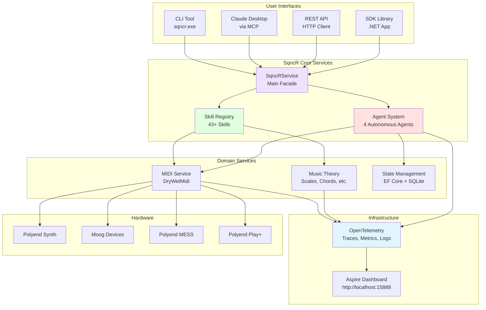

---

## Transport Layer Architecture

### All Transports Use Same Core

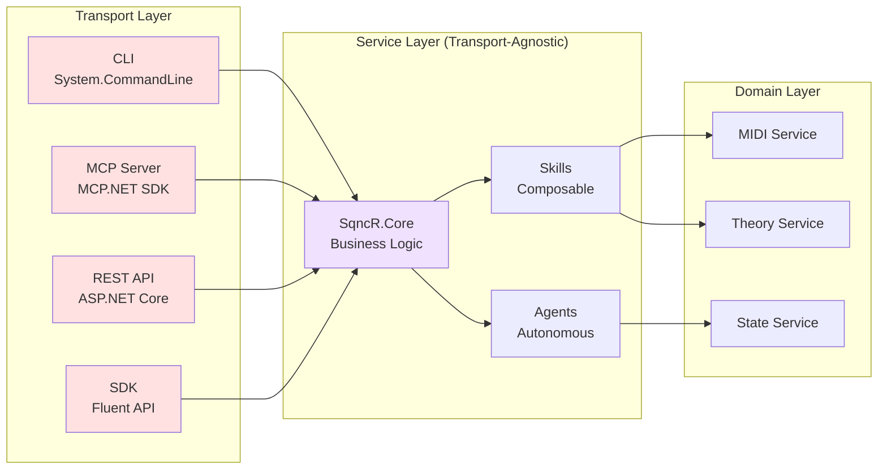

**Key Insight:** SqncR.Core has ZERO transport dependencies. Add new transports (SSH, gRPC, WebSocket) without changing Core!

---

## MIDI Message Flow

### From User Request to Hardware

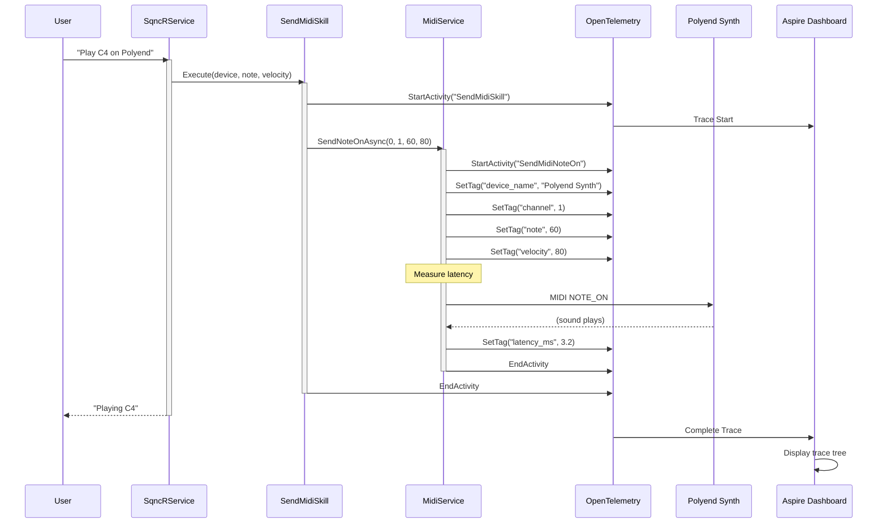

**Trace in Aspire Dashboard:**
```
SendMidiSkill (5.4ms)
  └─ SendMidiNoteOn (3.8ms)
     • device: Polyend Synth MIDI 1
     • channel: 1
     • note: 60 (C4)
     • velocity: 80
     • latency: 3.2ms
```

---

## Skill Execution Flow

### How Skills Are Discovered and Executed

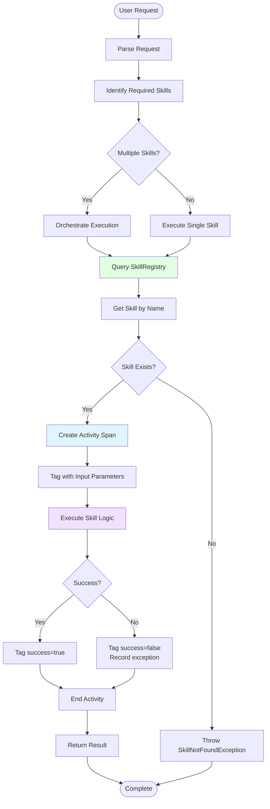

### Skill Composition Example

```mermaid
flowchart LR
    Request["User: 'ambient drone in Am, darker'"] --> VibeSkill["skill-vibe-to-music"]
    VibeSkill --> ScaleSkill["skill-scale-selector"]
    ScaleSkill --> ChordSkill["skill-chord-progression"]
    ChordSkill --> DeviceSkill["skill-device-selector"]
    DeviceSkill --> SendSkill["skill-send-midi"]
    SendSkill --> Result["Music Playing"]
    
    VibeSkill -.->|"mode: phrygian<br/>brightness: -0.3"| ScaleSkill
    ScaleSkill -.->|"A Phrygian scale"| ChordSkill
    ChordSkill -.->|"Am, Bb, Dm"| DeviceSkill
    DeviceSkill -.->|"Polyend Synth<br/>Channel 1"| SendSkill
    
    style VibeSkill fill:#ffe1e1
    style ScaleSkill fill:#e1ffe1
    style ChordSkill fill:#e1ffe1
    style DeviceSkill fill:#f0e1ff
    style SendSkill fill:#e1f5ff
```

---

## Agent State Machines

### CompositionAgent State Machine

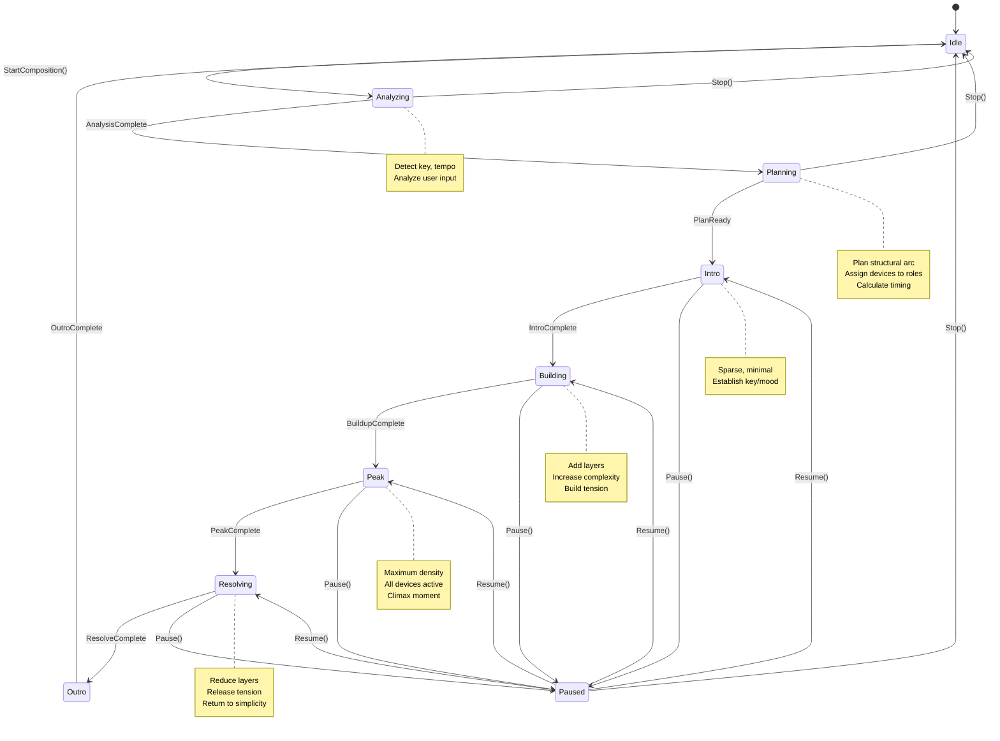

### ListenerAgent Real-Time Analysis

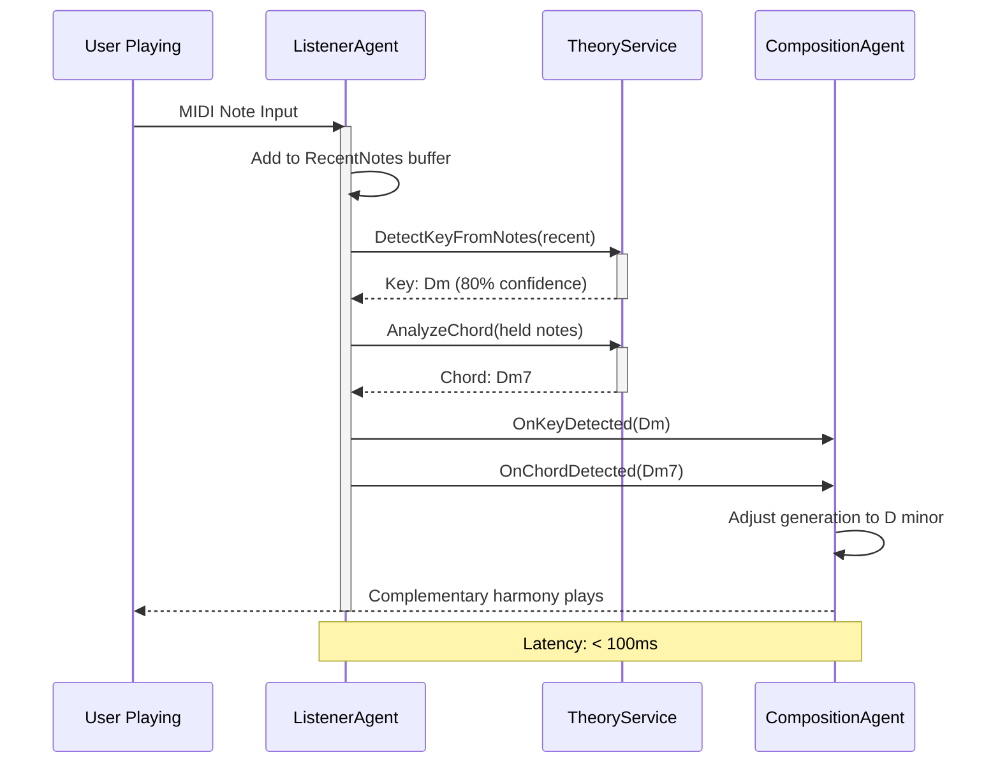

---

## Telemetry & Observability

### OpenTelemetry Spans Hierarchy

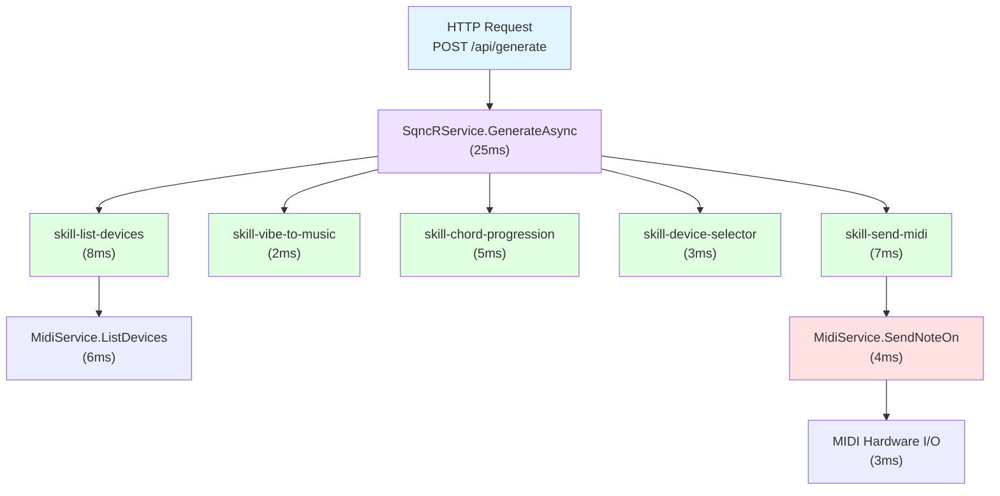

**Aspire Dashboard View:**
```
Trace: d4f2e1a8-9b3c-4d5e-8f9a-1b2c3d4e5f6a
Duration: 25ms

SqncRService.GenerateAsync (25ms)
├─ skill-list-devices (8ms)
│  └─ MidiService.ListDevices (6ms)
│     • devices_found: 4
│     • scan_time_ms: 5.8
├─ skill-vibe-to-music (2ms)
│  • concept: "darker"
│  • mode: "phrygian"
│  • brightness: -0.3
├─ skill-chord-progression (5ms)
│  • key: "A"
│  • mode: "minor"
│  • chords: ["Am7", "Dm7", "Fmaj7", "E7"]
├─ skill-device-selector (3ms)
│  • role: "bass"
│  • selected: "Moog Mother-32"
│  • reasoning: "Analog warmth perfect for sub-bass"
└─ skill-send-midi (7ms)
   └─ MidiService.SendNoteOn (4ms)
      • device: "Polyend Synth MIDI 1"
      • channel: 1
      • note: 60
      • velocity: 80
      • latency_ms: 3.2
```

### Telemetry Metrics Map

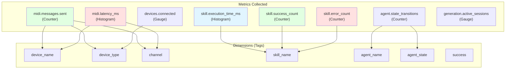

---

## User Workflows

### Workflow 1: "List My MIDI Devices"

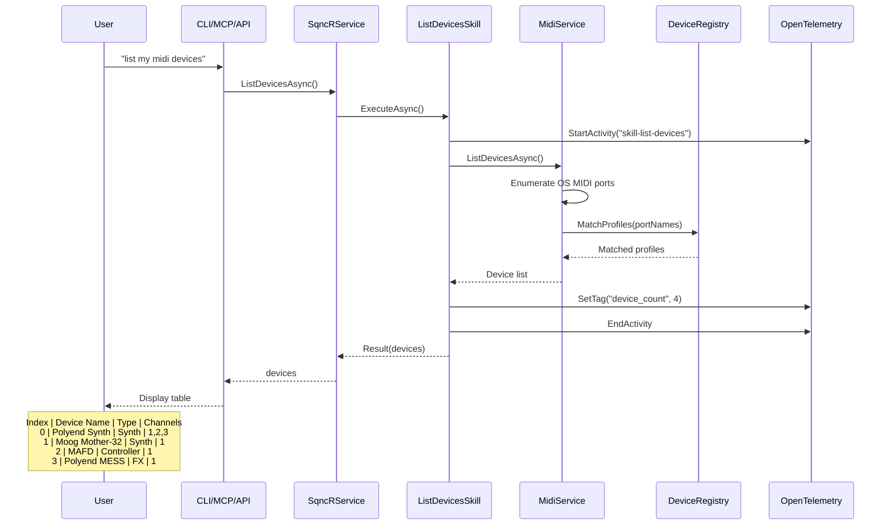

### Workflow 2: "Generate Ambient Drone in A Minor"

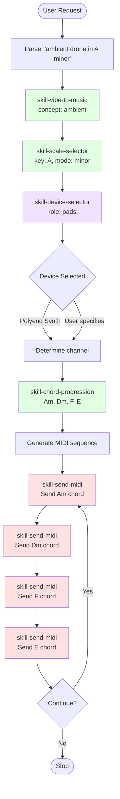

### Workflow 3: "Make It Darker" (Real-Time Modification)

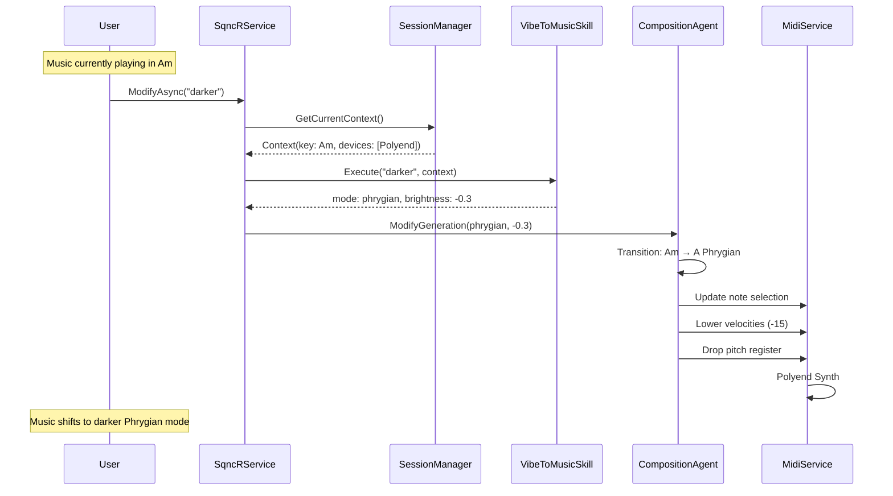

---

## Device Orchestration

### Multi-Device Coordination

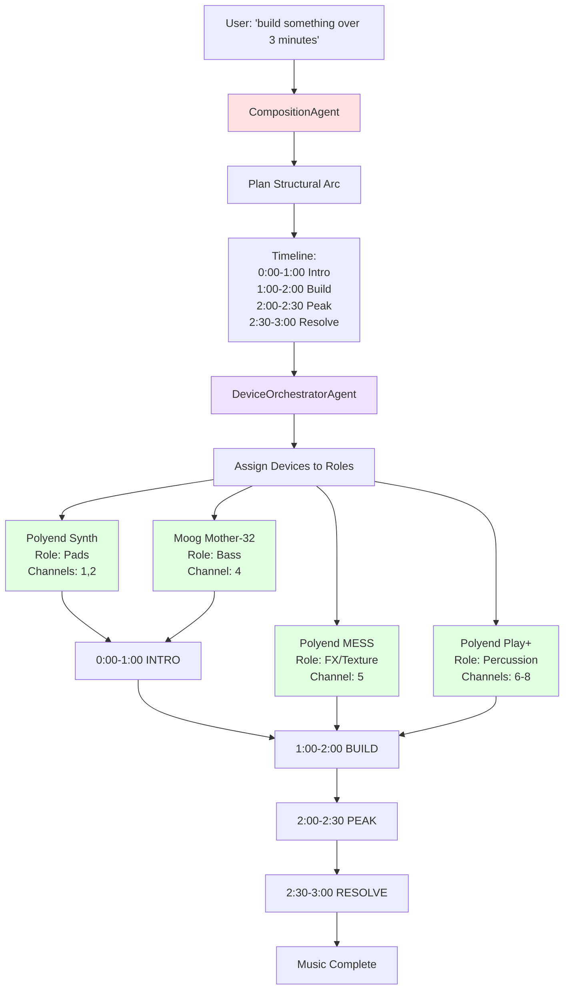

### Device State & Voice Allocation

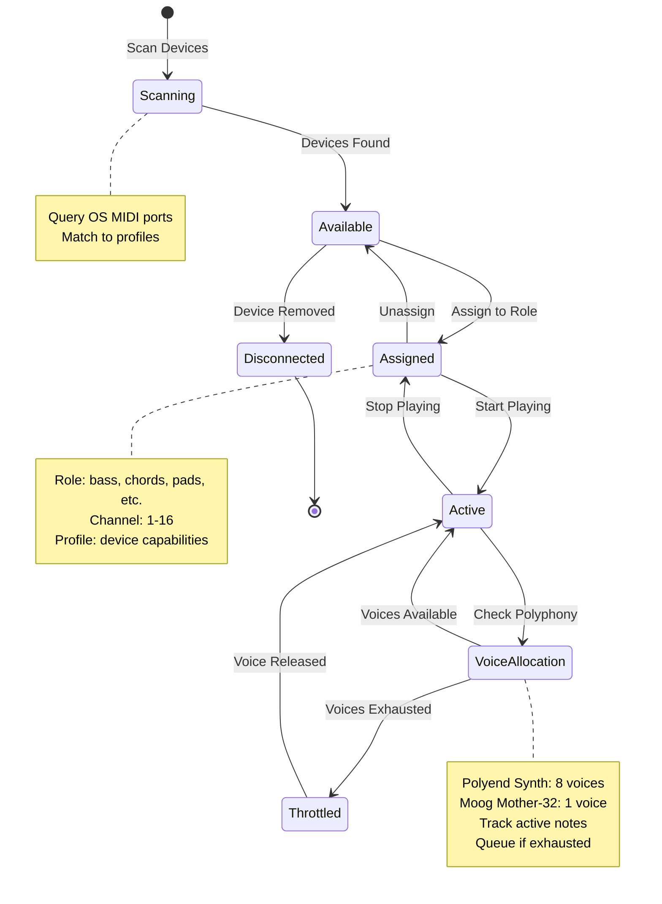

---

## Data Flow

### From User Intent to Sound

```mermaid
flowchart LR
    subgraph "Input Layer"
        U1["Natural Language<br/>'ambient drone in Am'"]
        U2["Structured Request<br/>{key:'Am', style:'ambient'}"]
    end
    
    subgraph "Intelligence Layer"
        Parse["Intent Parser"]
        Vibe["Vibe-to-Music<br/>Skill"]
        Theory["Music Theory<br/>Service"]
    end
    
    subgraph "Generation Layer"
        Scale["Scale<br/>Generation"]
        Chord["Chord<br/>Progression"]
        Voice["Voice<br/>Leading"]
    end
    
    subgraph "Device Layer"
        Select["Device<br/>Selector"]
        Map["Channel<br/>Mapping"]
    end
    
    subgraph "Output Layer"
        MIDI["MIDI<br/>Messages"]
        Hardware["Hardware<br/>Synths"]
        Sound["Sound<br/>Waves"]
    end
    
    U1 --> Parse
    U2 --> Parse
    Parse --> Vibe
    Vibe --> Theory
    
    Theory --> Scale
    Scale --> Chord
    Chord --> Voice
    
    Voice --> Select
    Select --> Map
    
    Map --> MIDI
    MIDI --> Hardware
    Hardware --> Sound
    
    style U1 fill:#e1f5ff
    style Parse fill:#f0e1ff
    style Theory fill:#e1ffe1
    style Voice fill:#ffe1e1
    style MIDI fill:#ffe1e1
    style Sound fill:#e1ffe1
```

### Session State Data Model

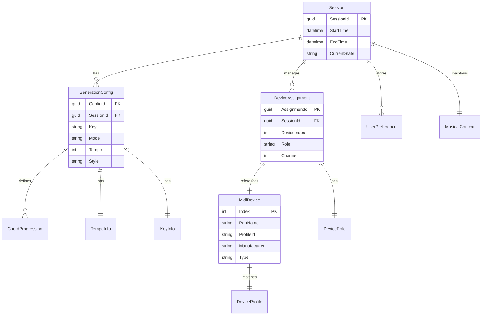

---

## Summary: Key Architectural Patterns

### 1. Transport-Agnostic Core
✅ **Pattern:** All transports call same SqncR.Core  
✅ **Benefit:** Add new interfaces without touching business logic  
✅ **Observable:** Every transport shows same traces in dashboard

### 2. Skill Composition
✅ **Pattern:** Small, focused skills combined for complex workflows  
✅ **Benefit:** Testable, reusable, composable  
✅ **Observable:** Each skill is a separate span with tags

### 3. Event-Driven Agents
✅ **Pattern:** Agents communicate via events, maintain state machines  
✅ **Benefit:** Autonomous behavior, coordinated without tight coupling  
✅ **Observable:** State transitions traced

### 4. OpenTelemetry First
✅ **Pattern:** Instrumentation built into framework (SkillBase, AgentBase)  
✅ **Benefit:** Every operation visible by default  
✅ **Observable:** Complete distributed trace from request to MIDI hardware

### 5. Device Abstraction
✅ **Pattern:** Device profiles separate from device control logic  
✅ **Benefit:** Add new devices via configuration, not code  
✅ **Observable:** Device operations tagged with profile metadata

---

## See Also

- [ARCHITECTURE.md](ARCHITECTURE.md) - Detailed architecture documentation
- [AGENTIC_ARCHITECTURE.md](AGENTIC_ARCHITECTURE.md) - Skills and agents deep dive
- [OBSERVABILITY.md](OBSERVABILITY.md) - OpenTelemetry implementation details
- [SKILLS.md](SKILLS.md) - Complete skills catalog
- [ROADMAP.md](ROADMAP.md) - Implementation roadmap

---

**Last Updated:** January 29, 2026
