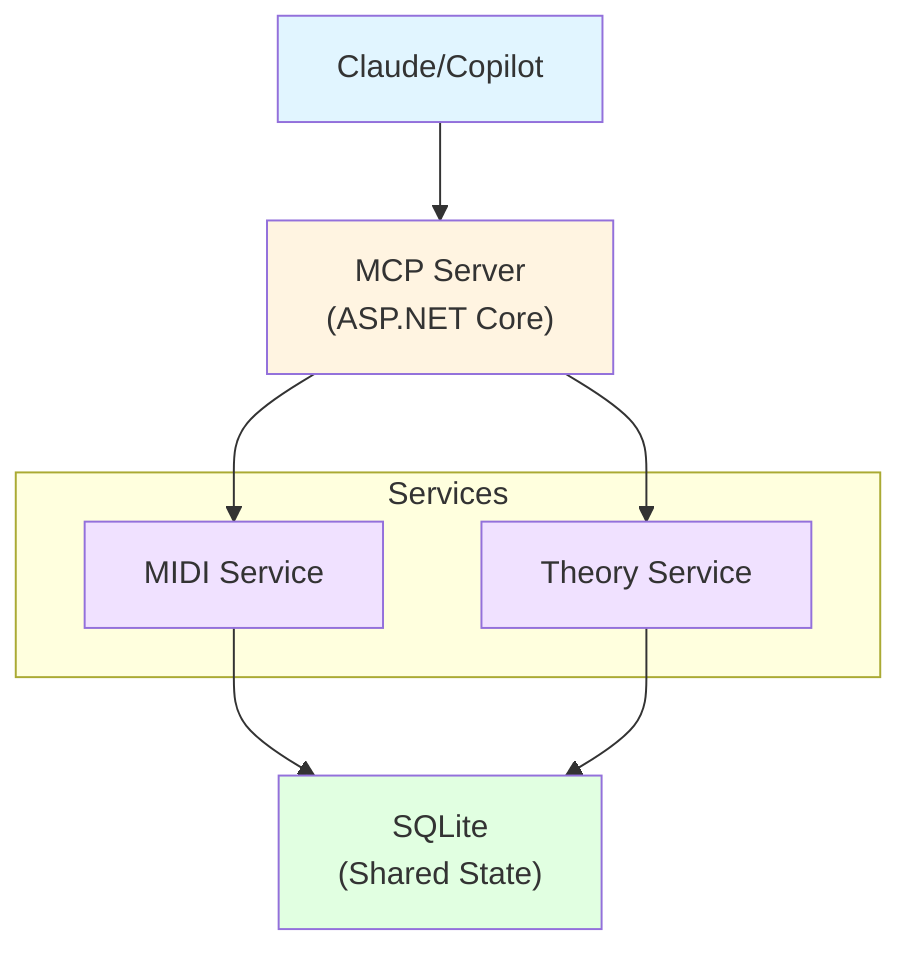
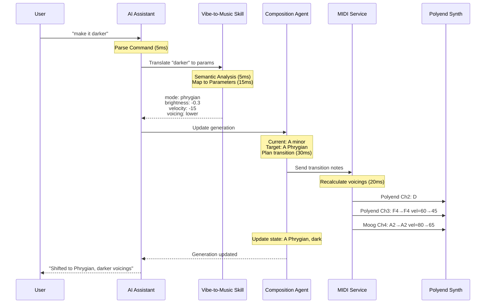
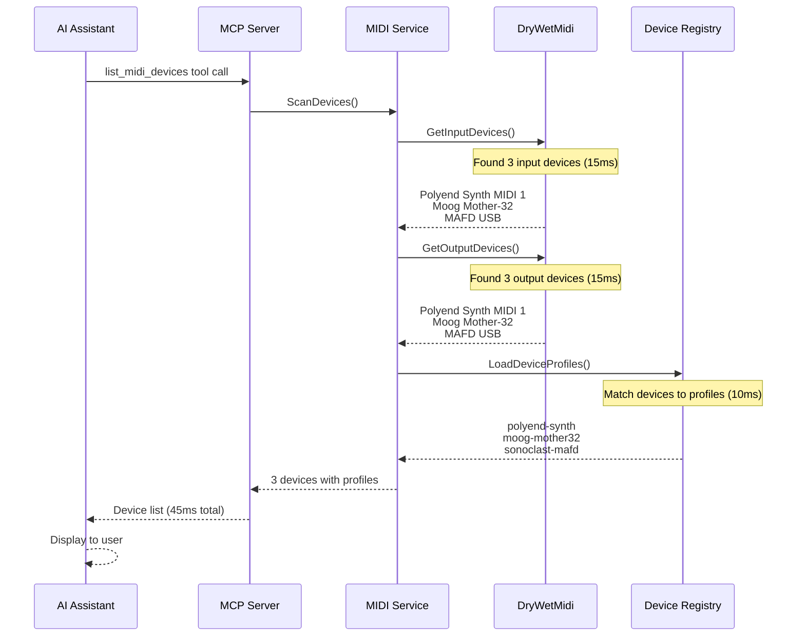
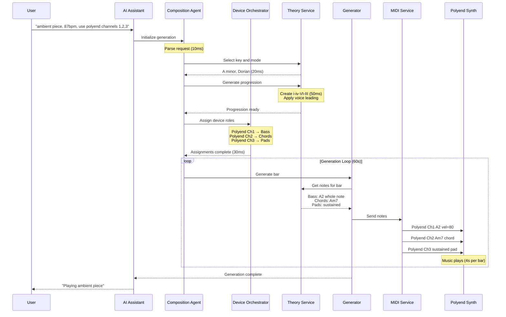

# SqncR Observability Strategy

**Using .NET Aspire + OpenTelemetry**

## Overview

SqncR uses [.NET Aspire](https://learn.microsoft.com/en-us/dotnet/aspire/) with [OpenTelemetry](https://opentelemetry.io/) to provide **complete observability** of music generation. Every MIDI message, every musical decision, every device interaction is traced and visible in the [Aspire Dashboard](https://learn.microsoft.com/en-us/dotnet/aspire/fundamentals/dashboard).

**Why This Matters:**
- **Debugging**: See exactly what MIDI messages are being sent and when
- **Understanding**: Understand why the AI made specific musical choices
- **Performance**: Monitor latency, throughput, voice allocation
- **Development**: Rapid feedback during generation algorithm development

---

## Aspire Dashboard

### What You See in Real-Time

**URL:** `http://localhost:15888` (when running with Aspire)

#### 1. Distributed Traces
Every musical operation creates a trace:

```
Generate Ambient Drone (5.2s)
├─ Select Key: A minor (2ms)
│  └─ Query Music Theory (1ms)
├─ Generate Chord Progression (15ms)
│  ├─ Create Progression: i-iv-VI-III (8ms)
│  └─ Voice Leading Optimization (7ms)
├─ Select Devices (5ms)
│  ├─ Device Selector: Bass → Moog Mother-32 (2ms)
│  └─ Device Selector: Pads → Polyend Synth Ch3 (3ms)
└─ Generate MIDI (5.1s)
   ├─ Send Note: Moog CH4 A2 vel=80 (500ms)
   │  └─ MIDI Out: Moog Mother-32 [CH:4 NOTE:45 VEL:80] (1ms)
   ├─ Send Note: Polyend CH3 C4 vel=60 (2000ms)
   │  └─ MIDI Out: Polyend Synth [CH:3 NOTE:60 VEL:60] (1ms)
   └─ ... (more notes)
```

#### 2. Logs (Structured)
```
[INFO] MusicTheory: Selected scale A Dorian for ambient vibe
[DEBUG] DeviceSelector: Moog Mother-32 chosen for bass (analog, warm)
[INFO] MidiService: Sending NOTE_ON to Moog Mother-32 [CH:4 NOTE:45 VEL:80]
[DEBUG] MidiService: Message sent in 0.8ms
[INFO] Generation: Playing 4-voice chord Am7 using Polyend Synth Ch2,3
```

#### 3. Metrics
- **MIDI Messages/Second**: Throughput per device
- **Message Latency**: Time from decision to MIDI out
- **Voice Allocation**: Current voices used per device
- **Generation Rate**: Notes generated per second
- **Theory Computations**: Cache hit rate for scale/chord lookups

#### 4. Resource Monitoring
- MCP Server: CPU, memory, requests/sec
- MIDI Service: Active devices, message queue depth
- Theory Service: Computation time, cache size
- Database: Query performance, connection pool

---

## OpenTelemetry Instrumentation

### MIDI Message Tracing

Every MIDI message is traced with rich attributes:

```csharp
using var activity = ActivitySource.StartActivity("SendMidiNote");
activity?.SetTag("midi.device_id", "moog-mother32-001");
activity?.SetTag("midi.device_name", "Moog Mother-32");
activity?.SetTag("midi.channel", 4);
activity?.SetTag("midi.message_type", "NOTE_ON");
activity?.SetTag("midi.note", 45); // A2
activity?.SetTag("midi.velocity", 80);
activity?.SetTag("midi.duration_ms", 500);
activity?.SetTag("midi.timestamp", DateTimeOffset.UtcNow);

// Musical context
activity?.SetTag("musical.role", "bass");
activity?.SetTag("musical.key", "A minor");
activity?.SetTag("musical.scale", "Dorian");
activity?.SetTag("musical.chord", "Am7");
activity?.SetTag("musical.function", "tonic");

// Performance
activity?.SetTag("latency_ms", stopwatch.ElapsedMilliseconds);

await midiDevice.SendNoteOnAsync(channel: 4, note: 45, velocity: 80);
```

**Result in Dashboard:**
- See every note as a span
- Filter by device, channel, note range
- Group by musical context (key, chord, role)
- Visualize timing and overlaps

### Music Theory Tracing

```csharp
using var activity = ActivitySource.StartActivity("GenerateChordProgression");
activity?.SetTag("theory.key", "A");
activity?.SetTag("theory.mode", "minor");
activity?.SetTag("theory.vibe", "dark");
activity?.SetTag("theory.bars", 4);

var progression = await theoryService.GenerateProgressionAsync(
    key: "A",
    mode: "minor",
    vibe: "dark",
    bars: 4
);

activity?.SetTag("theory.progression", string.Join("-", progression)); // "i-iv-VI-III"
activity?.SetTag("theory.tension_curve", JsonSerializer.Serialize(tensionCurve));
```

**Result in Dashboard:**
- Understand why specific chords were chosen
- See tension/release curves
- Trace from high-level "darker" to specific mode shift

### Device Selection Tracing

```csharp
using var activity = ActivitySource.StartActivity("SelectDevice");
activity?.SetTag("selector.role", "bass");
activity?.SetTag("selector.characteristics", "warm,analog,fat");
activity?.SetTag("selector.available_devices", availableDevices.Count);

var device = await deviceSelector.SelectForRoleAsync(
    role: "bass",
    characteristics: ["warm", "analog", "fat"]
);

activity?.SetTag("selector.selected_device", device.Name);
activity?.SetTag("selector.selected_channel", device.DefaultChannel);
activity?.SetTag("selector.reasoning", "Analog warmth matches ambient vibe");
```

**Result in Dashboard:**
- See why Moog was chosen over Polyend
- Understand device selection logic
- Debug incorrect device assignments

### Agent State Tracing

```csharp
using var activity = ActivitySource.StartActivity("AgentStateTransition");
activity?.SetTag("agent.name", "composition");
activity?.SetTag("agent.state_from", "building");
activity?.SetTag("agent.state_to", "peak");
activity?.SetTag("agent.intensity_from", 4);
activity?.SetTag("agent.intensity_to", 8);
activity?.SetTag("agent.trigger", "3_minute_mark");

await compositionAgent.TransitionToAsync(CompositionState.Peak);
```

**Result in Dashboard:**
- Visualize agent state machine
- See what triggered state changes
- Debug autonomous behavior

---

## Custom Metrics

### MIDI Throughput
```csharp
private static readonly Counter<long> s_midiMessagesSent = 
    Meter.CreateCounter<long>(
        "sqncr.midi.messages.sent",
        description: "Number of MIDI messages sent"
    );

// When sending message
s_midiMessagesSent.Add(1, new KeyValuePair<string, object?>("device", deviceName));
```

**Dashboard:** Chart of messages/sec per device

### Generation Latency
```csharp
private static readonly Histogram<double> s_generationLatency = 
    Meter.CreateHistogram<double>(
        "sqncr.generation.latency",
        unit: "ms",
        description: "Time to generate musical decision"
    );

// After generation
s_generationLatency.Record(stopwatch.ElapsedMilliseconds, 
    new KeyValuePair<string, object?>("operation", "chord_voicing"));
```

**Dashboard:** Latency distribution histogram

### Voice Allocation
```csharp
private static readonly ObservableGauge<int> s_voicesUsed = 
    Meter.CreateObservableGauge<int>(
        "sqncr.voices.used",
        () => GetVoiceCount(),
        description: "Current voices allocated per device"
    );
```

**Dashboard:** Real-time gauge per device

---

## Aspire Service Architecture

### AppHost Configuration

```csharp
// src/SqncR.AppHost/Program.cs
var builder = DistributedApplication.CreateBuilder(args);

// SQLite for state
var sqlite = builder.AddSqlite("sqlite")
    .WithDataVolume();

// Music Theory Service
var theoryService = builder.AddProject<Projects.SqncR_Theory>("theory")
    .WithReplicas(1);

// MIDI Service (critical path - low latency)
var midiService = builder.AddProject<Projects.SqncR_Midi>("midi")
    .WithReference(theoryService)
    .WithReplicas(1);

// MCP Server (exposed to Claude/Copilot)
var mcpServer = builder.AddProject<Projects.SqncR_McpServer>("mcp-server")
    .WithReference(midiService)
    .WithReference(theoryService)
    .WithReference(sqlite)
    .WithHttpEndpoint(port: 8765, name: "mcp");

builder.Build().Run();
```

### Service Dependencies



---

## Example Traces

### Trace 1: "Make it darker"



### Trace 2: List MIDI Devices



### Trace 3: Generate Ambient Piece



---

## Development Workflow with Aspire

### 1. Start Aspire AppHost
```bash
cd src/SqncR.AppHost
dotnet run
```

### 2. Aspire Dashboard Opens
- **URL:** http://localhost:15888
- All services start automatically
- Logs stream in real-time

### 3. Make a Code Change
- Edit music theory algorithm
- Edit MIDI generation logic
- Hot reload applies instantly

### 4. Test & Observe
- Send command via MCP
- Watch traces appear in dashboard
- See MIDI messages being sent
- Verify musical decisions

### 5. Debug Issues
- Click on trace to see full span tree
- Filter logs by service/level
- View metrics for performance
- Inspect MIDI message attributes

---

## Production Deployment

### Observability in Production

**OpenTelemetry Exporters:**
```csharp
// Export to Aspire Dashboard (dev)
builder.Services.AddOpenTelemetry()
    .UseOtlpExporter();

// Export to Azure Monitor (production)
builder.Services.AddOpenTelemetry()
    .UseAzureMonitor();

// Export to Jaeger (self-hosted)
builder.Services.AddOpenTelemetry()
    .AddOtlpExporter(options => {
        options.Endpoint = new Uri("http://jaeger:4317");
    });
```

**What You Get:**
- All MIDI traces in production
- Performance monitoring
- Error tracking
- User session playback

---

## Best Practices

### DO: Trace Musical Decisions
```csharp
✅ activity?.SetTag("theory.reasoning", "Phrygian creates darker mood");
✅ activity?.SetTag("device.selection_reason", "Analog warmth matches vibe");
✅ activity?.SetTag("musical.tension", tensionScore);
```

### DO: Use Semantic Attributes
```csharp
✅ activity?.SetTag("midi.device", "Polyend Synth");
✅ activity?.SetTag("midi.channel", 1);
✅ activity?.SetTag("midi.note", 60);
```

### DON'T: Trace Every Sample
```csharp
❌ // Don't trace individual samples/ticks
   for (int i = 0; i < 1000000; i++) {
       using var activity = ActivitySource.StartActivity("ProcessSample");
       // Too many spans!
   }
```

### DO: Use Metrics for High-Frequency Data
```csharp
✅ // Use counter for message counts
   s_midiMessagesSent.Add(1);
```

### DO: Add Context to Errors
```csharp
✅ try {
       await midiDevice.SendNoteAsync(note);
   } catch (Exception ex) {
       activity?.SetStatus(ActivityStatusCode.Error, ex.Message);
       activity?.RecordException(ex);
       throw;
   }
```

---

## Summary

**With .NET Aspire + OpenTelemetry, SqncR provides:**
- ✅ **Complete visibility** into music generation
- ✅ **Real-time debugging** of MIDI communication
- ✅ **Understanding** of AI musical decisions
- ✅ **Performance monitoring** for low-latency requirements
- ✅ **Production-ready observability** from day one

**The Aspire Dashboard is not just for debugging—it's a window into the creative process.**

---

**Learn More:**
- [.NET Aspire Documentation](https://learn.microsoft.com/en-us/dotnet/aspire/)
- [OpenTelemetry .NET](https://opentelemetry.io/docs/languages/net/)
- [Aspire Dashboard](https://learn.microsoft.com/en-us/dotnet/aspire/fundamentals/dashboard)
- [OpenTelemetry Semantic Conventions](https://opentelemetry.io/docs/specs/semconv/)
