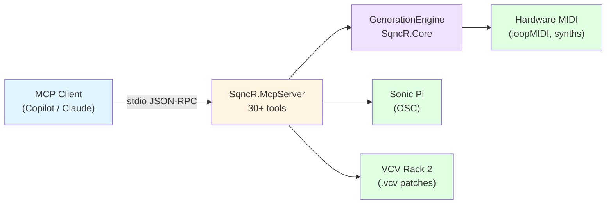

# SqncR

**AI-Native Generative Music for MIDI Devices**

> Talk to your studio. Create organic, evolving music through conversation with AI.

## What is SqncR?

SqncR (Sequencer) is an MCP server for generative music. You sit in your IDE, enable the MCP server, tell it about your setup, and it generates music while you code. It works with hardware MIDI devices, [Sonic Pi](https://sonic-pi.net/), and [VCV Rack 2](https://vcvrack.com/).

- Code in VS Code on your left monitor
- Chat with Copilot or Claude on your right monitor
- Say *"ambient drone, 87 BPM, darker"* — your synths start playing
- Keep coding while the music evolves

## Status: V1 Complete ✅

**5 milestones delivered · 586 tests · 30+ MCP tools**

| Milestone | Scope |
|-----------|-------|
| M0 | Aspire infrastructure, OpenTelemetry, ServiceDefaults |
| M1 | MCP server, MIDI generation engine, core tools, music theory |
| M2 | Sonic Pi integration, VCV Rack patch generation |
| M3 | Session persistence, scene presets, variety engine, smooth transitions |
| M4 | Instrument abstraction, device profiles, multi-channel generation, setup tools |

## Quick Start

```bash
# 1. Clone
git clone https://github.com/bradygaster/SqncR.git
cd SqncR

# 2. Install .NET 9 SDK (or later — global.json uses rollForward: latestMajor)
#    https://dotnet.microsoft.com/download

# 3. Install a virtual MIDI driver + a synth
#    loopMIDI  → https://www.tobias-erichsen.de/software/loopmidi.html
#    Sonic Pi  → https://sonic-pi.net/
#    VCV Rack  → https://vcvrack.com/

# 4. Build
dotnet build SqncR.slnx

# 5. Run the MCP server (stdio transport)
dotnet run --project src/SqncR.McpServer
```

### Connect from VS Code / GitHub Copilot

The repo ships `.vscode/mcp.json` — Copilot discovers SqncR automatically after cloning.

### Connect from Claude Desktop

Add to `%APPDATA%\Claude\claude_desktop_config.json` (Windows) or `~/.config/claude/claude_desktop_config.json` (macOS/Linux):

```json
{
  "mcpServers": {
    "sqncr": {
      "command": "dotnet",
      "args": ["run", "--project", "C:/path/to/SqncR/src/SqncR.McpServer"]
    }
  }
}
```

## Architecture



### Projects

| Project | Purpose |
|---------|---------|
| `SqncR.Core` | Generation engine, music theory, rhythm patterns, instruments, persistence |
| `SqncR.Theory` | Scale/mode library, note parsing |
| `SqncR.Midi` | DryWetMidi MIDI I/O |
| `SqncR.SonicPi` | OSC client, Ruby code generation |
| `SqncR.VcvRack` | Patch templates, launcher |
| `SqncR.McpServer` | MCP server (stdio), all tool definitions |
| `SqncR.Testing` | Spectral analysis, canary tests |
| `SqncR.AppHost` | Aspire orchestrator |
| `SqncR.ServiceDefaults` | Shared OTel + resilience config |

## MCP Tools

### Core

| Tool | Description |
|------|-------------|
| `ping` | Health check — confirms the MCP server is alive |
| `list_devices` | Lists available MIDI output devices |
| `open_device` | Opens a MIDI output device by index or name |
| `start_generation` | Starts music generation (tempo, scale, rootNote, pattern, octave, variety) |
| `modify_generation` | Modifies parameters without stopping (supports `smooth` transitions) |
| `stop_generation` | Stops playback and silences all notes |
| `get_status` | Returns current engine state (tempo, scale, pattern, channels) |

### Session Persistence

| Tool | Description |
|------|-------------|
| `save_session` | Saves current generation state as a named session |
| `load_session` | Restores a previously saved session |
| `list_sessions` | Lists all saved sessions |

### Scene Presets

| Tool | Description |
|------|-------------|
| `save_scene` | Saves current state as a named scene preset |
| `load_scene` | Loads a scene preset (user or built-in) |
| `list_scenes` | Lists all scenes (user-saved + built-in) |
| `delete_scene` | Deletes a user-saved scene |

### Instrument Setup

| Tool | Description |
|------|-------------|
| `setup_instrument` | Conversational setup — creates profile, registers instrument, auto-assigns channel |
| `describe_instrument` | Detailed description including CC mappings |
| `list_setup_instruments` | Lists registered instruments grouped by role |
| `remove_setup_instrument` | Removes instrument, sends AllNotesOff, optionally deletes profile |

### Instrument (Engine)

| Tool | Description |
|------|-------------|
| `add_instrument` | Adds an instrument to the generation engine |
| `remove_instrument` | Removes an instrument from the generation engine |
| `list_instruments` | Lists all instruments and their roles/channels |

### Sonic Pi

| Tool | Description |
|------|-------------|
| `setup_software_synth` | Creates a Sonic Pi instrument with synth engine + optional FX chain |
| `play_sonic_pi_note` | Plays a single note (accepts note names or MIDI numbers) |
| `sonic_pi_live_loop` | Creates and sends a `live_loop` with note sequence at specified BPM |
| `stop_sonic_pi` | Stops all running Sonic Pi code |
| `sonic_pi_status` | Checks whether Sonic Pi is reachable via OSC |

### VCV Rack

| Tool | Description |
|------|-------------|
| `generate_patch` | Generates a `.vcv` patch from a template (basic, ambient, bass) |
| `launch_vcv_rack` | Launches VCV Rack 2 with a patch file |
| `stop_vcv_rack` | Stops the running VCV Rack process |
| `vcv_rack_status` | Returns VCV Rack running state and MIDI port |
| `list_templates` | Lists available patch templates |

### Health

| Tool | Description |
|------|-------------|
| `get_health` | Health snapshot — tick latency, active notes, memory, uptime, missed ticks |
| `all_notes_off` | Panic button — sends note-off for all active notes |

📖 **[Full MCP Integration Guide →](docs/mcp-integration.md)** — tool signatures, parameters, example conversations, and troubleshooting.

## Key Features

- **Multi-channel generation** — assign instruments to roles and MIDI channels
- **Role-based instruments** — Bass, Pad, Lead, Drums, Melody with per-role behavior
- **Smooth transitions** — tempo and scale changes glide over bars instead of snapping
- **Variety engine** — conservative, moderate, or adventurous variation levels
- **Session persistence** — save/load complete generation state (JSON, `~/.sqncr/sessions/`)
- **Scene presets** — instant-recall named configurations with 3 built-in presets
- **10 drum patterns** — rock, house, hip-hop, jazz, ambient, breakbeat, half-time, shuffle, latin-clave, bossa-nova
- **17 scales/modes** — Major, Minor, Harmonic Minor, Melodic Minor, Pentatonic Major/Minor, Blues, Whole Tone, Diminished, Chromatic, Dorian, Phrygian, Lydian, Mixolydian, Ionian, Aeolian, Locrian
- **Device profiles** — persistent JSON profiles with CC mappings and velocity curves (`~/.sqncr/devices/`)
- **Sonic Pi integration** — OSC-based synth control, live loops, FX chains
- **VCV Rack integration** — patch generation from templates, headless launch
- **Spectral analysis testing** — frequency-domain validation of generated output
- **Per-device telemetry** — OpenTelemetry spans for every MIDI message and generation decision
- **Polyrhythms** — layered drum patterns with per-voice velocity and probability

## Example Conversation

```
You: "What MIDI devices do I have?"
→ list_devices
  Found 1 MIDI output device(s):
    [0] loopMIDI Port

You: "Open it and set up a Sonic Pi pad synth"
→ open_device(deviceName: "loopMIDI")
  Opened MIDI device: loopMIDI Port
→ setup_instrument(name: "Pad", type: "SonicPi", role: "Pad")
  ✅ Instrument 'Pad' set up — Ch 1, SonicPi, range 24-108

You: "Start something ambient in A minor, 90 BPM, moderate variety"
→ start_generation(tempo: 90, scale: "minor", rootNote: "A3", pattern: "ambient", variety: "moderate")
  Started generation: 90 BPM, A Minor (root A3), ambient pattern, octave 4, variety moderate

You: "Make it bluesier, smooth transition"
→ modify_generation(scale: "blues", smooth: true)
  Modified generation:
    Scale → A Blues (smooth)

You: "Save this as 'late-night-coding'"
→ save_session(name: "late-night-coding")
  Session 'late-night-coding' saved.

You: "Stop"
→ stop_generation
  Generation stopped.
```

## Project Structure

```
src/
  SqncR.AppHost/           # Aspire orchestrator
  SqncR.Core/              # Generation engine, rhythm, instruments, persistence
  SqncR.Cli/               # CLI entry point
  SqncR.McpServer/         # MCP server + 30+ tool definitions
  SqncR.Midi/              # DryWetMidi MIDI I/O
  SqncR.ServiceDefaults/   # Shared OTel + resilience
  SqncR.SonicPi/           # Sonic Pi OSC integration
  SqncR.Testing/           # Spectral analysis, test helpers
  SqncR.Theory/            # Scales, modes, note parsing
  SqncR.VcvRack/           # VCV Rack patch generation + launcher

tests/
  SqncR.Core.Tests/
  SqncR.Integration.Tests/
  SqncR.Midi.Tests/
  SqncR.SonicPi.Tests/
  SqncR.Testing.Tests/
  SqncR.Theory.Tests/
  SqncR.VcvRack.Tests/
```

## Built-In Presets

### Scene Presets

| Scene | Description |
|-------|-------------|
| `ambient-pad` | Slow, atmospheric, sparse percussion |
| `driving-techno` | Four-on-the-floor, high energy |
| `chill-lofi` | Relaxed hip-hop feel |

### Device Profiles

| Profile | Type | Role | Channel |
|---------|------|------|---------|
| `moog-sub37` | Hardware | Bass | 1 |
| `roland-juno` | Hardware | Pad | 2 |
| `sonic-pi-default` | SonicPi | Melody | 1 |

## Documentation

- [MCP Integration Guide](docs/mcp-integration.md) — full tool reference, parameters, and examples
- [Blog: Building SqncR — From Zero to Generative Engine](docs/blog/2026-02-13-building-sqncr-from-zero-to-generative-engine.md)
- [Blog: Software Synths — Sonic Pi & VCV Rack](docs/blog/2026-02-14-software-synths-sonic-pi-vcv-rack.md)
- [Blog: Stream-Ready Stability, Variety & Persistence](docs/blog/2026-02-15-stream-ready-stability-variety-persistence.md)
- [Blog: Know Your Gear — Instruments & Multi-Channel](docs/blog/2026-02-16-know-your-gear-instruments-and-multi-channel.md)

## Technology Stack

| Layer | Technology |
|-------|-----------|
| Runtime | .NET 9, C# |
| Orchestration | .NET Aspire |
| MCP SDK | [ModelContextProtocol](https://github.com/modelcontextprotocol/csharp-sdk) (stdio transport) |
| MIDI | [Melanchall.DryWetMidi](https://github.com/melanchall/drywetmidi) |
| Observability | OpenTelemetry (traces + metrics → Aspire Dashboard) |
| Math | MathNet.Numerics |
| Compression | ZstdSharp |

## Testing

**586 tests** across 7 test projects.

- **Unit tests** — engine, theory, patterns, instruments, persistence
- **Integration tests** — end-to-end MCP tool flows
- **Spectral analysis** — frequency-domain validation of generated audio
- **Canary tests** — early-warning failure detection
- **Failure recovery** — engine resilience under intermittent MIDI failures

```bash
dotnet test SqncR.slnx
```

## Contributing

Contributions welcome! The repo uses:

- **Branch strategy:** `main` is the default branch
- **.NET conventions:** nullable enabled, implicit usings, `TreatWarningsAsErrors` (src/ only)
- **Test coverage:** new features should include tests

## License

*TBD*

---

**Maintainer:** Brady Gaster ([@bradygaster](https://github.com/bradygaster))

**Built with:** Music theory, MIDI magic, and conversational AI ✨🎹🎵
