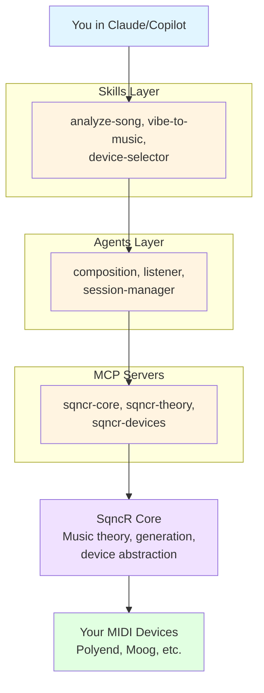

# SqncR

**AI-Native Generative Music for MIDI Devices**

> Talk to your studio. Create organic, evolving music through conversation with AI.

## What is SqncR?

SqncR (Sequencer) is an AI-first generative music system that lets you control your MIDI devices through natural language conversation. Built as an MCP (Model Context Protocol) server, it works seamlessly with Claude Desktop, GitHub Copilot, and other AI assistants.

**The Vision:**
- Code in VSCode on your left monitor
- Chat with Claude/Copilot on your right monitor
- Say "create an ambient drone, 87 BPM, darker"
- Your hardware synths start playing
- Keep coding while the music evolves

## Status: Planning & Architecture Phase

🚧 **Currently:** Designing architecture and establishing patterns  
📋 **Next:** Building MCP server and device abstraction layer  
🎯 **Goal:** Production-ready agentic music system

## Core Principles

**Device-Agnostic**
- Works with any MIDI device (synths, drum machines, FX, lights)
- Device profiles define capabilities, not the architecture
- Add new devices without changing core code

**AI-Native**
- Natural language is the interface (no UI)
- Conversation-driven music creation
- Works in Claude, Copilot, or any MCP-compatible AI

**Musically Intelligent**
- Deep music theory understanding (scales, modes, harmony)
- Translates abstract concepts to music ("make it sound like Rothko")
- Sophisticated chord progressions and voice leading

**Agentic Architecture**
- **Skills:** Discrete tasks (analyze-song, vibe-to-music)
- **Agents:** Autonomous, stateful (composition, listener, orchestrator)
- **MCP Servers:** Stateful services with tools/resources

## Example Workflows

### Workflow 1: Quick Generation
```
You: "list my midi devices"
SqncR: [Shows Polyend Synth, Moog Mother-32, etc.]

You: "ambient but rhythmic, 87bpm. polyend bass on channel 1, 
      chords on 2, pads on 3"
SqncR: [Music starts playing through your Polyend]

You: "darker"
SqncR: [Shifts to Phrygian mode, lowers voicings]

You: "more polyrhythms"
SqncR: [Adds 3-against-4 feel]
```

### Workflow 2: Abstract Concepts
```
You: "make it sound like Rothko makes you feel"
SqncR: [Slow harmonic rhythm, extended chords, warm sustained tones]

You: "shift to something like Jon Hopkins"
SqncR: [Adds intricate rhythms, forward momentum, glitchy elements]
```

### Workflow 3: Song Recreation
```
You: "i want it to sound like that cream song from the breakfast club"
SqncR: [Searches, identifies "I'm So Glad", extracts key/tempo, 
        generates in E blues with shuffle feel]
```

### Workflow 4: Interactive Jamming
```
You: "listen to what i play and complement me"
SqncR: [Monitors MIDI input, detects your chords, generates 
        complementary bass and fills]
```

## Architecture Overview



### Components

**Skills (Composable Tasks)**
- `skill-analyze-song` - Extract musical data from song descriptions
- `skill-vibe-to-music` - Translate concepts (Rothko, film noir) to parameters
- `skill-chord-progression` - Generate theory-based progressions
- `skill-device-selector` - Choose best device for musical role
- `skill-polyrhythm-generator` - Create complex rhythmic patterns

**Agents (Autonomous, Stateful)**
- `agent-session-manager` - Maintains musical coherence and state
- `agent-composition` - High-level structure and orchestration
- `agent-listener` - Real-time input analysis and adaptation
- `agent-device-orchestrator` - Multi-device coordination

**MCP Servers**
- `sqncr-core` - Main server with generation/session tools
- `sqncr-theory` - Music theory computations
- `sqncr-devices` - Device registry and profiles

## Supported Devices (Planned)

**Current Focus:**
- [Polyend Synth](https://polyend.com/synth/) (3 engines, 8 voices)
- [Moog Mother-32](https://www.moogmusic.com/products/mother-32) (analog mono synth)
- [Moog DFAM](https://www.moogmusic.com/products/dfam-drummer-another-mother) (analog drum machine)
- [Sonoclast MAFD](https://sonoclast.com/products/mafd/) (MIDI adapter for DFAM)
- [Polyend MESS](https://polyend.com/mess/) (multi-FX step sequencer pedal)
- [Polyend Play+](https://polyend.com/play/) (sampler/sequencer)
- MIDI lighting controllers

**Architecture supports ANY MIDI device** - just add a device profile.

## Technology Stack

**Primary Stack: .NET 9+ with Aspire**
- **[.NET Aspire](https://learn.microsoft.com/en-us/dotnet/aspire/)** - Distributed application framework
- **[OpenTelemetry](https://opentelemetry.io/)** - Observability for MIDI signals and generation
- **[Aspire Dashboard](https://learn.microsoft.com/en-us/dotnet/aspire/fundamentals/dashboard)** - Real-time monitoring and tracing
- **C#** - Primary language for MCP servers, agents, skills

**MIDI Layer: .NET**
- **[Melanchall.DryWetMidi](https://github.com/melanchall/drywetmidi)** - Comprehensive .NET MIDI library
- **[NAudio.Midi](https://github.com/naudio/NAudio)** - Alternative MIDI library
- Low-latency MIDI I/O with full observability

**Music Theory: .NET**
- Custom music theory library in C#
- Or port [`tonal`](https://github.com/tonaljs/tonal) concepts to .NET
- Strongly-typed scale/chord/progression system

**MCP Protocol: .NET**
- **[MCP.NET](https://github.com/modelcontextprotocol/csharp-sdk)** - C# SDK for Model Context Protocol
- ASP.NET Core for MCP server hosting
- SignalR or gRPC for real-time communication

**State Management**
- **SQLite** with Entity Framework Core
- Session persistence
- Device registry
- User presets

**Observability Stack**
- **OpenTelemetry** instrumentation throughout
- **Aspire Dashboard** for real-time visualization
- Custom traces for:
  - MIDI message sending (device, channel, note, velocity)
  - Music theory computations (scales, chords, progressions)
  - Generation decisions (why this note, why this timing)
  - Device selection logic
  - Agent state transitions

**Why .NET + Aspire?**
- **Performance**: Low-latency MIDI with modern .NET runtime
- **Observability**: Built-in OpenTelemetry, see every MIDI message in Aspire Dashboard
- **Distributed**: Aspire orchestrates multiple services (MCP server, MIDI handler, theory engine)
- **Strongly Typed**: C# type system for music theory, device profiles, MIDI messages
- **Tooling**: Excellent IDE support (Visual Studio, Rider, VS Code)
- **Modern**: .NET 9+ with latest language features

## Getting Started (Future)

```bash
# Clone repo
git clone https://github.com/bradygaster/SqncR.git
cd SqncR

# Install .NET 9 SDK
# https://dotnet.microsoft.com/download

# Restore dependencies
dotnet restore

# Configure your devices
cp appsettings.example.json appsettings.json
# Edit with your MIDI setup

# Run with Aspire (launches dashboard + all services)
cd src/SqncR.AppHost
dotnet run

# Aspire Dashboard opens at http://localhost:15888
# - View MIDI traces in real-time
# - Monitor music generation
# - Debug device communication

# MCP server runs at configured port
# Add to Claude Desktop config:
# ~/.config/claude/claude_desktop_config.json
{
  "mcpServers": {
    "sqncr": {
      "command": "dotnet",
      "args": ["run", "--project", "path/to/SqncR.McpServer/SqncR.McpServer.csproj"]
    }
  }
}

# Talk to Claude
"list my midi devices"
"start an ambient piece"

# Watch the Aspire Dashboard to see:
# - MIDI messages being sent (device, channel, note, velocity, timing)
# - Music theory computations (scale selection, chord voicing)
# - Agent decisions (why this device, why this note)
# - Generation state changes
```

## Documentation

- [README.md](README.md) - Project overview and getting started
- [CONCEPT.md](CONCEPT.md) - High-level vision and philosophy
- [ARCHITECTURE.md](ARCHITECTURE.md) - AI-native system design
- [AGENTIC_ARCHITECTURE.md](AGENTIC_ARCHITECTURE.md) - Skills, Agents, MCP details
- [MUSIC_THEORY.md](MUSIC_THEORY.md) - Theory concepts and conversational design
- [OBSERVABILITY.md](OBSERVABILITY.md) - Aspire + OpenTelemetry observability
- [SKILLS.md](SKILLS.md) - Complete catalog of all available skills
- [CONTRIBUTING.md](CONTRIBUTING.md) - Development guidelines and ground rules
- [DOCS_INDEX.md](DOCS_INDEX.md) - Complete documentation index

## External Resources

- [Model Context Protocol](https://modelcontextprotocol.io/) - MCP documentation
- [MIDI Association](https://www.midi.org/) - Official MIDI standards
- [Music Theory Resources](https://www.musictheory.net/) - Reference materials

## Contributing

We're in the planning phase. Contributions welcome once core architecture is established.

See [CONTRIBUTING.md](CONTRIBUTING.md) for:
- Branch strategy (use `main`, not `master`)
- Code standards
- Commit message format
- PR process
- Musical philosophy

## Why SqncR?

**For Musicians:**
- No UI to learn - just talk
- Works with gear you already own
- Real-time, organic music generation
- Sophisticated music theory built-in

**For Developers:**
- Modern agentic architecture
- Clean separation of concerns (Skills/Agents/MCP)
- Extensible device profiles
- Example of "the right way" to build AI apps

**For AI Enthusiasts:**
- Real-world agentic application
- Natural language → domain-specific actions
- Stateful agents with autonomy
- MCP protocol implementation

## License

*TBD - Private repo during development*

## Contact

**Maintainer:** Brady Gaster ([@bradygaster](https://github.com/bradygaster))

**Repository:** [https://github.com/bradygaster/SqncR](https://github.com/bradygaster/SqncR) (Private)

---

**Built with:** Music theory, MIDI magic, and conversational AI ✨🎹🎵
