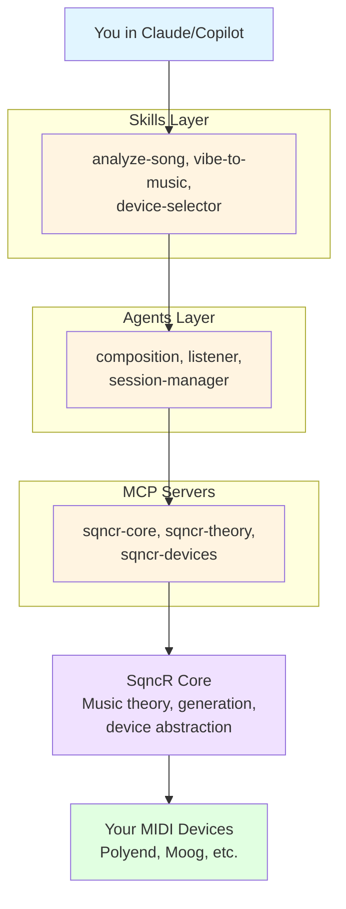

# SqncR

**AI-Native Generative Music for MIDI Devices**

> Talk to your studio. Create organic, evolving music through conversation with AI.

---

## 🎯 What is SqncR?

SqncR (Sequencer) is an AI-first generative music system that lets you control your MIDI devices through natural language conversation. Built as an MCP (Model Context Protocol) server, it works seamlessly with Claude Desktop, GitHub Copilot, and other AI assistants.

**The Vision:**
- Code in VSCode on your left monitor
- Chat with Claude/Copilot on your right monitor
- Say "create an ambient drone, 87 BPM, darker"
- Your hardware synths start playing
- Keep coding while the music evolves

---

## 📊 Status: Planning & Architecture Phase

🚧 **Currently:** Designing architecture and establishing patterns  
📋 **Next:** Building MCP server and device abstraction layer  
🎯 **Goal:** Production-ready agentic music system

---

## ⭐ Core Principles

### Device-Agnostic
Works with any MIDI device (synths, drum machines, FX, lights). Device profiles define capabilities, not the architecture. Add new devices without changing core code.

### AI-Native
Natural language is the interface (no UI). Conversation-driven music creation. Works in Claude, Copilot, or any MCP-compatible AI.

### Musically Intelligent
Deep music theory understanding (scales, modes, harmony). Translates abstract concepts to music ("make it sound like Rothko"). Sophisticated chord progressions and voice leading.

### Agentic Architecture
- **Skills:** Discrete tasks (analyze-song, vibe-to-music)
- **Agents:** Autonomous, stateful (composition, listener, orchestrator)
- **MCP Servers:** Stateful services with tools/resources

---

## 🚀 Quick Start

### For Users (Future)

```bash
# Install
dotnet tool install -g SqncR.Cli

# Configure devices
sqncr config init

# Start music
sqncr generate "ambient drone, darker"

# Or use with Claude Desktop
# (Add to ~/.config/claude/claude_desktop_config.json)
```

### For AI Assistants

**Start here when working on SqncR:**

1. Read [.sqncr/memory/architecture.md](.sqncr/memory/architecture.md) - Key architectural decisions
2. Read [.sqncr/memory/conventions.md](.sqncr/memory/conventions.md) - Coding standards
3. Review [.sqncr/commands/README.md](.sqncr/commands/README.md) - Slash commands available
4. Check [.sqncr/todos/current-sprint.md](.sqncr/todos/current-sprint.md) - Active work

**Use slash commands for efficiency:**
- `/new-skill <name>` - Create new skill with boilerplate
- `/sprint status` - Show current progress
- `/adr <title>` - Document architectural decision

### For Developers

```bash
# Clone repo
git clone https://github.com/bradygaster/SqncR.git
cd SqncR

# See current structure
cat START_HERE.md

# Review architecture
cat docs/ARCHITECTURE.md

# Start with Sprint 00
cat docs/sprints/sprint_00_foundation.md
```

---

## 📁 Repository Structure

```
SqncR/
├── README.md               # This file
├── START_HERE.md           # Complete reorganization guide
├── REORGANIZE.md           # PowerShell script for migration
│
├── src/                    # Source code (Sprint 00+)
│   ├── SqncR.Core/        # Business logic, skills, agents
│   ├── SqncR.Midi/        # MIDI I/O service
│   ├── SqncR.Theory/      # Music theory engine
│   ├── SqncR.State/       # State management
│   ├── SqncR.Cli/         # CLI tool
│   ├── SqncR.McpServer/   # MCP server
│   ├── SqncR.Api/         # REST API
│   └── SqncR.Sdk/         # .NET SDK
│
├── docs/                   # Documentation
│   ├── README.md          # Documentation index
│   ├── ARCHITECTURE.md    # System architecture
│   ├── CONCEPT.md         # Vision and philosophy
│   ├── ROADMAP.md         # Implementation plan
│   ├── SKILLS.md          # Skills catalog
│   ├── diagrams/          # Architecture diagrams
│   │   ├── system-overview.md
│   │   ├── transport-layer.md
│   │   ├── midi-message-flow.md
│   │   └── ... (7 total)
│   └── sprints/           # Sprint plans
│       ├── sprint_00_foundation.md
│       ├── sprint_01_theory-and-midi.md
│       └── ... (7 total)
│
└── .sqncr/                # AI Memory System
    ├── memory/            # Architectural decisions
    │   ├── architecture.md
    │   ├── conventions.md
    │   ├── patterns.md
    │   └── decisions.md
    ├── todos/             # Sprint tracking
    │   ├── current-sprint.md
    │   └── backlog.md
    └── commands/          # Slash commands
        └── README.md
```

---

## 🎵 Example Workflows

### Workflow 1: Quick Generation
```
You: "list my midi devices"
SqncR: [Shows Polyend Synth, Moog Mother-32, etc.]

You: "ambient but rhythmic, 87bpm. polyend bass on channel 1, 
      chords on 2, pads on 3"
SqncR: [Music starts playing through your Polyend]

You: "darker"
SqncR: [Shifts to Phrygian mode, lowers voicings]
```

### Workflow 2: Abstract Concepts
```
You: "make it sound like Rothko makes you feel"
SqncR: [Slow harmonic rhythm, extended chords, warm sustained tones]

You: "shift to something like Jon Hopkins"
SqncR: [Adds intricate rhythms, forward momentum, glitchy elements]
```

### Workflow 3: Interactive Jamming
```
You: "listen to what i play and complement me"
SqncR: [Monitors MIDI input, detects your chords, generates 
        complementary bass and fills]
```

---

## 🏗️ Architecture Overview



**See:** [docs/diagrams/](docs/diagrams/) for detailed architecture diagrams

---

## 💻 Technology Stack

**Primary Stack: .NET 9+ with Aspire**

- **[.NET Aspire](https://learn.microsoft.com/en-us/dotnet/aspire/)** - Distributed application framework
- **[OpenTelemetry](https://opentelemetry.io/)** - Observability for MIDI signals and generation
- **[Melanchall.DryWetMidi](https://github.com/melanchall/drywetmidi)** - Comprehensive .NET MIDI library
- **[MCP.NET](https://github.com/modelcontextprotocol/csharp-sdk)** - C# SDK for Model Context Protocol
- **Entity Framework Core + SQLite** - State persistence

**Why .NET + Aspire?**
- **Performance**: Low-latency MIDI with modern .NET runtime
- **Observability**: Built-in OpenTelemetry, see every MIDI message in Aspire Dashboard
- **Distributed**: Aspire orchestrates multiple services
- **Strongly Typed**: C# type system for music theory, device profiles, MIDI messages

---

## 🎹 Supported Devices (Planned)

**Current Focus:**
- [Polyend Synth](https://polyend.com/synth/) (3 engines, 8 voices)
- [Moog Mother-32](https://www.moogmusic.com/products/mother-32) (analog mono synth)
- [Moog DFAM](https://www.moogmusic.com/products/dfam-drummer-another-mother) (analog drum machine)
- [Sonoclast MAFD](https://sonoclast.com/products/mafd/) (MIDI adapter for DFAM)
- [Polyend MESS](https://polyend.com/mess/) (multi-FX step sequencer pedal)
- [Polyend Play+](https://polyend.com/play/) (sampler/sequencer)

**Architecture supports ANY MIDI device** - just add a device profile.

---

## 📚 Documentation

### Getting Started
- [START_HERE.md](START_HERE.md) - Complete reorganization guide and quick start
- [docs/CONCEPT.md](docs/CONCEPT.md) - High-level vision and philosophy
- [docs/CONTRIBUTING.md](docs/CONTRIBUTING.md) - Development guidelines

### Architecture & Design
- [docs/ARCHITECTURE.md](docs/ARCHITECTURE.md) - AI-native system design
- [docs/AGENTIC_ARCHITECTURE.md](docs/AGENTIC_ARCHITECTURE.md) - Skills, Agents, MCP details
- [docs/MUSIC_THEORY.md](docs/MUSIC_THEORY.md) - Theory concepts and conversational design
- [docs/OBSERVABILITY.md](docs/OBSERVABILITY.md) - Aspire + OpenTelemetry observability

### Implementation
- [docs/ROADMAP.md](docs/ROADMAP.md) - Implementation roadmap
- [docs/SKILLS.md](docs/SKILLS.md) - Complete catalog of all available skills
- [docs/sprints/](docs/sprints/) - Detailed sprint plans (6 sprints to v1.0)

### Visual Documentation
- [docs/diagrams/](docs/diagrams/) - Architecture diagrams (7 separate files)
- [docs/diagrams/system-overview.md](docs/diagrams/system-overview.md) - Start here

### AI Memory System
- [.sqncr/README.md](.sqncr/README.md) - How AI assistants learn SqncR context
- [.sqncr/memory/architecture.md](.sqncr/memory/architecture.md) - Key architectural decisions
- [.sqncr/memory/conventions.md](.sqncr/memory/conventions.md) - Coding standards
- [.sqncr/commands/README.md](.sqncr/commands/README.md) - Slash commands for efficiency

---

## 🛠️ Development

### Prerequisites (When Ready)

- [.NET 9 SDK](https://dotnet.microsoft.com/download)
- [Visual Studio 2024](https://visualstudio.microsoft.com/) or [VS Code](https://code.visualstudio.com/)
- MIDI devices (optional, can use virtual MIDI)

### Building (Future)

```bash
# Clone and restore
git clone https://github.com/bradygaster/SqncR.git
cd SqncR
dotnet restore

# Run with Aspire (launches dashboard + all services)
cd src/SqncR.AppHost
dotnet run

# Aspire Dashboard opens at http://localhost:15888
```

### Contributing

See [docs/CONTRIBUTING.md](docs/CONTRIBUTING.md) for:
- Branch strategy (use `main`, not `master`)
- Code standards
- Commit message format
- PR process
- Musical philosophy

---

## 🎯 Roadmap

**Phase 0: Foundation** (2 weeks) - ✅ Complete
- [x] Architecture design
- [x] Documentation
- [x] Repository organization
- [x] AI memory system

**Phase 1: Core Service Layer** (4 weeks) - 🔲 Not Started
- [ ] Music theory library
- [ ] MIDI service
- [ ] Core skills framework
- [ ] Basic generation

**Phase 2: Transport Layers** (4 weeks)
- [ ] CLI tool
- [ ] MCP server
- [ ] REST API
- [ ] .NET SDK

**Phase 3+:** Advanced skills, agents, production readiness

**See:** [docs/ROADMAP.md](docs/ROADMAP.md) and [docs/sprints/](docs/sprints/) for details

---

## 🎉 Why SqncR?

**For Musicians:**
- No UI to learn - just talk
- Works with gear you already own
- Real-time, organic music generation
- Sophisticated music theory built-in

**For Developers:**
- Modern agentic architecture
- Clean separation of concerns (Skills/Agents/MCP)
- Extensible device profiles
- Example of "the right way" to build AI apps

**For AI Enthusiasts:**
- Real-world agentic application
- Natural language → domain-specific actions
- Stateful agents with autonomy
- MCP protocol implementation

---

## 📞 Contact

**Maintainer:** Brady Gaster ([@bradygaster](https://github.com/bradygaster))

**Repository:** [https://github.com/bradygaster/SqncR](https://github.com/bradygaster/SqncR)

---

## 📄 License

*TBD - Private repo during development*

---

**Built with:** Music theory, MIDI magic, and conversational AI ✨🎹🎵

