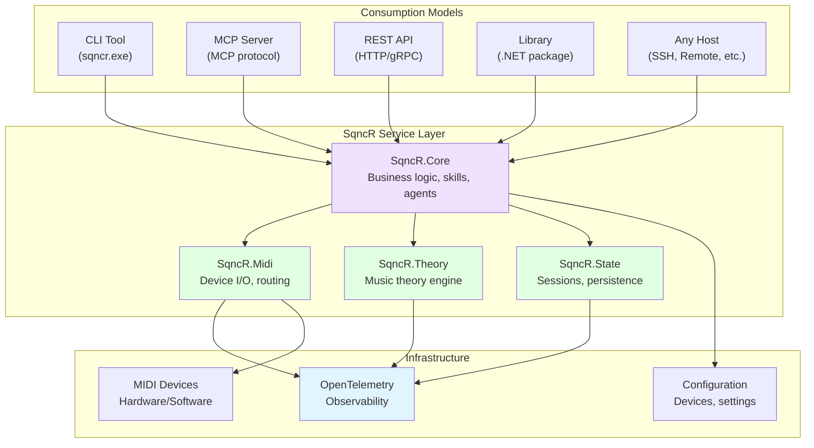

# SqncR Implementation Roadmap

**Building SqncR the Right Way: Service-First Architecture**

## Core Architecture Principle

**SqncR Core = Headless Service Layer**



**Key Concept:** 
- **SqncR.Core** = Pure business logic, no transport layer
- **Transports** (CLI, MCP, API, Library) are thin wrappers around Core
- **Skills** are part of Core, callable from any transport
- **Agents** run in Core, accessible via any interface
- **Observability** is built into Core, not transport

---

## Project Structure

```
SqncR/
├── src/
│   ├── SqncR.AppHost/                    # Aspire orchestration
│   │   └── Program.cs
│   │
│   ├── SqncR.Core/                       # ⭐ Core service layer
│   │   ├── Skills/                       # All skills
│   │   │   ├── ISkill.cs
│   │   │   ├── SkillBase.cs
│   │   │   ├── Musical/
│   │   │   │   ├── VibeToMusicSkill.cs
│   │   │   │   ├── ChordProgressionSkill.cs
│   │   │   │   └── VoiceLeadingSkill.cs
│   │   │   ├── Device/
│   │   │   │   ├── ListDevicesSkill.cs
│   │   │   │   ├── DeviceSelectorSkill.cs
│   │   │   │   └── SendMidiSkill.cs
│   │   │   └── Analysis/
│   │   │       ├── AnalyzeSongSkill.cs
│   │   │       └── DetectKeySkill.cs
│   │   │
│   │   ├── Agents/                       # Autonomous agents
│   │   │   ├── IAgent.cs
│   │   │   ├── SessionManagerAgent.cs
│   │   │   ├── CompositionAgent.cs
│   │   │   ├── ListenerAgent.cs
│   │   │   └── DeviceOrchestratorAgent.cs
│   │   │
│   │   ├── Services/                     # Core services
│   │   │   ├── IGenerationService.cs
│   │   │   └── GenerationService.cs
│   │   │
│   │   └── SqncRService.cs              # Main service facade
│   │
│   ├── SqncR.Midi/                       # MIDI I/O service
│   │   ├── IMidiService.cs
│   │   ├── MidiService.cs                # Uses DryWetMidi
│   │   ├── Devices/
│   │   │   ├── DeviceRegistry.cs
│   │   │   └── Profiles/
│   │   │       ├── IDeviceProfile.cs
│   │   │       ├── PolyendSynthProfile.cs
│   │   │       ├── MoogMother32Profile.cs
│   │   │       └── etc...
│   │   └── Routing/
│   │       └── MidiRouter.cs
│   │
│   ├── SqncR.Theory/                     # Music theory engine
│   │   ├── IMusicTheoryService.cs
│   │   ├── MusicTheoryService.cs
│   │   ├── Models/
│   │   │   ├── Note.cs                   # Value type
│   │   │   ├── Scale.cs                  # Value type
│   │   │   ├── Chord.cs                  # Value type
│   │   │   ├── Interval.cs               # Value type
│   │   │   └── Progression.cs
│   │   └── Algorithms/
│   │       ├── ScaleGenerator.cs
│   │       ├── ChordVoicer.cs
│   │       └── ProgressionBuilder.cs
│   │
│   ├── SqncR.State/                      # State management
│   │   ├── ISessionRepository.cs
│   │   ├── SessionRepository.cs          # EF Core + SQLite
│   │   ├── Models/
│   │   │   ├── Session.cs
│   │   │   ├── Instrument.cs
│   │   │   └── GenerationConfig.cs
│   │   └── SqncRDbContext.cs
│   │
│   ├── SqncR.Cli/                        # ⭐ CLI transport
│   │   ├── Program.cs                    # sqncr.exe
│   │   ├── Commands/
│   │   │   ├── ListDevicesCommand.cs
│   │   │   ├── GenerateCommand.cs
│   │   │   ├── ModifyCommand.cs
│   │   │   └── StopCommand.cs
│   │   └── Uses: System.CommandLine
│   │
│   ├── SqncR.McpServer/                  # ⭐ MCP transport
│   │   ├── Program.cs                    # MCP server host
│   │   ├── Tools/                        # MCP tool handlers
│   │   │   ├── ListDevicesTool.cs
│   │   │   ├── GenerateTool.cs
│   │   │   └── etc...
│   │   ├── Resources/                    # MCP resources
│   │   │   ├── DevicesResource.cs
│   │   │   └── SessionResource.cs
│   │   └── Uses: MCP.NET SDK
│   │
│   ├── SqncR.Api/                        # ⭐ REST API transport
│   │   ├── Program.cs                    # ASP.NET Core
│   │   ├── Controllers/
│   │   │   ├── DevicesController.cs
│   │   │   ├── GenerationController.cs
│   │   │   └── SessionController.cs
│   │   └── Uses: ASP.NET Core Minimal APIs
│   │
│   └── SqncR.Sdk/                        # ⭐ Library transport
│       ├── SqncRClient.cs                # Fluent API
│       └── Uses: SqncR.Core directly
│
├── tests/
│   ├── SqncR.Core.Tests/
│   ├── SqncR.Midi.Tests/
│   ├── SqncR.Theory.Tests/
│   └── SqncR.Integration.Tests/
│
├── docs/
│   └── (all .md files)
│
└── examples/
    ├── cli-examples.sh
    ├── mcp-config.json
    └── api-examples.http
```

---

## Phase 0: Foundation (Week 1-2)

### ✅ Planning Complete
- [x] Architecture documented
- [x] Skills catalog created
- [x] Device profiles designed
- [x] Observability strategy defined

### 🔲 Project Setup

#### TODO: Initialize Solution
```bash
# Create .NET solution
dotnet new sln -n SqncR

# Create Aspire AppHost
dotnet new aspire-apphost -n SqncR.AppHost
dotnet sln add src/SqncR.AppHost

# Create service defaults
dotnet new aspire-servicedefaults -n SqncR.ServiceDefaults
dotnet sln add src/SqncR.ServiceDefaults
```

- [ ] Create solution structure
- [ ] Add Aspire AppHost project
- [ ] Add ServiceDefaults project
- [ ] Configure global.json for .NET 9
- [ ] Set up Directory.Build.props
- [ ] Configure OpenTelemetry defaults

#### TODO: Core Libraries
```bash
# Core service layer
dotnet new classlib -n SqncR.Core
dotnet sln add src/SqncR.Core

# MIDI service
dotnet new classlib -n SqncR.Midi
dotnet sln add src/SqncR.Midi

# Music theory
dotnet new classlib -n SqncR.Theory
dotnet sln add src/SqncR.Theory

# State management
dotnet new classlib -n SqncR.State
dotnet sln add src/SqncR.State
```

- [ ] Create SqncR.Core project
- [ ] Create SqncR.Midi project
- [ ] Create SqncR.Theory project
- [ ] Create SqncR.State project
- [ ] Add project references
- [ ] Add NuGet packages:
  - [ ] Melanchall.DryWetMidi
  - [ ] Microsoft.EntityFrameworkCore.Sqlite
  - [ ] OpenTelemetry packages
  - [ ] System.Text.Json

#### TODO: Test Projects
```bash
dotnet new xunit -n SqncR.Core.Tests
dotnet new xunit -n SqncR.Theory.Tests
dotnet new xunit -n SqncR.Midi.Tests
dotnet sln add tests/SqncR.Core.Tests
dotnet sln add tests/SqncR.Theory.Tests
dotnet sln add tests/SqncR.Midi.Tests
```

- [ ] Create test projects for each library
- [ ] Add FluentAssertions
- [ ] Add Moq for mocking
- [ ] Set up test fixtures

---

## Phase 1: Core Service Layer (Week 3-4)

### 🔲 Music Theory Library (SqncR.Theory)

#### TODO: Value Types
```csharp
// SqncR.Theory/Models/Note.cs
public readonly record struct Note(int MidiNumber)
{
    public string Name => GetNoteName(MidiNumber);
    public int Octave => (MidiNumber / 12) - 1;
    public double Frequency(double a4 = 440.0) => 
        a4 * Math.Pow(2, (MidiNumber - 69) / 12.0);
}
```

- [ ] Implement `Note` value type
- [ ] Implement `Interval` value type
- [ ] Implement `Scale` record
- [ ] Implement `Chord` record
- [ ] Implement `Progression` class
- [ ] Add unit tests for all theory types
- [ ] Document with XML comments

#### TODO: Theory Algorithms
- [ ] Scale generation (all modes)
- [ ] Chord construction (triads, 7ths, extensions)
- [ ] Voice leading optimizer
- [ ] Progression builder with tension curves
- [ ] Interval calculator
- [ ] Key detection algorithm
- [ ] Add OpenTelemetry instrumentation
- [ ] Unit tests with music theory correctness validation

### 🔲 MIDI Service (SqncR.Midi)

#### TODO: Device Management
```csharp
// SqncR.Midi/IMidiService.cs
public interface IMidiService
{
    Task<IReadOnlyList<MidiDevice>> ListDevicesAsync();
    Task SendNoteOnAsync(int deviceIndex, int channel, int note, int velocity);
    Task SendNoteOffAsync(int deviceIndex, int channel, int note);
    Task SendControlChangeAsync(int deviceIndex, int channel, int cc, int value);
}
```

- [ ] Create IMidiService interface
- [ ] Implement MidiService with DryWetMidi
- [ ] Device scanning and enumeration
- [ ] Device profile loading and matching
- [ ] MIDI message sending with OpenTelemetry traces
- [ ] Device state tracking
- [ ] Error handling and recovery
- [ ] Mock MIDI devices for testing

#### TODO: Device Profiles
- [ ] IDeviceProfile interface
- [ ] PolyendSynthProfile
- [ ] MoogMother32Profile
- [ ] MoogDfamProfile
- [ ] SonoclastMafdProfile
- [ ] PolyendMessProfile
- [ ] PolyendPlayProfile
- [ ] Profile registry and matching logic
- [ ] JSON-based custom profiles (user-extensible)

### 🔲 Core Service (SqncR.Core)

#### TODO: Skill Framework
```csharp
// SqncR.Core/Skills/ISkill.cs
public interface ISkill
{
    string Name { get; }
    string Description { get; }
    Task<SkillResult> ExecuteAsync(SkillInput input, CancellationToken ct);
}

// SqncR.Core/Skills/SkillRegistry.cs
public interface ISkillRegistry
{
    ISkill GetSkill(string name);
    IEnumerable<ISkill> GetAllSkills();
}
```

- [ ] Create ISkill interface
- [ ] Create SkillBase abstract class with OpenTelemetry
- [ ] Create SkillRegistry
- [ ] Dependency injection setup for skills
- [ ] Skill discovery mechanism
- [ ] Error handling framework

#### TODO: Core Skills (Priority 1 - MVP)
- [ ] skill-list-devices
- [ ] skill-send-midi
- [ ] skill-device-selector
- [ ] skill-chord-progression
- [ ] skill-vibe-to-music
- [ ] skill-scale-selector
- [ ] Each skill with unit tests
- [ ] Each skill with OpenTelemetry spans

#### TODO: Agent Framework
- [ ] IAgent interface
- [ ] AgentBase abstract class
- [ ] Agent state management
- [ ] Agent lifecycle (start, stop, pause)

#### TODO: Core Agents (Priority 1 - MVP)
- [ ] SessionManagerAgent (state tracking)
- [ ] CompositionAgent (basic generation)
- [ ] Tests for agent state transitions

#### TODO: Main Service Facade
```csharp
// SqncR.Core/SqncRService.cs
public class SqncRService
{
    public async Task<SessionInfo> StartSessionAsync();
    public async Task<GenerationResult> GenerateAsync(GenerationRequest request);
    public async Task ModifyGenerationAsync(string instruction);
    public async Task StopGenerationAsync();
    public async Task<IReadOnlyList<MidiDevice>> ListDevicesAsync();
}
```

- [ ] Create SqncRService facade
- [ ] Wire up skills, agents, services
- [ ] Dependency injection configuration
- [ ] OpenTelemetry ActivitySource setup
- [ ] Integration tests

### 🔲 State Management (SqncR.State)

#### TODO: Database Models
- [ ] Session entity
- [ ] Instrument entity
- [ ] GenerationConfig entity
- [ ] UserPreference entity
- [ ] DbContext with migrations

#### TODO: Repositories
- [ ] ISessionRepository
- [ ] SessionRepository implementation
- [ ] Device configuration persistence
- [ ] Session save/load functionality

---

## Phase 2: Transport Layers (Week 5-6)

### 🔲 CLI Tool (SqncR.Cli)

#### TODO: CLI Application
```bash
# Usage examples:
sqncr list-devices
sqncr generate "ambient drone in Am, 60 BPM"
sqncr modify "darker"
sqncr stop
sqncr session save "my-session"
sqncr session load "my-session"
```

**Uses:** [System.CommandLine](https://learn.microsoft.com/en-us/dotnet/standard/commandline/)

- [ ] Create CLI project
- [ ] Add System.CommandLine package
- [ ] Implement commands:
  - [ ] list-devices
  - [ ] generate
  - [ ] modify
  - [ ] stop
  - [ ] session (save/load/list)
  - [ ] config (show/edit)
- [ ] Wire to SqncR.Core
- [ ] Add rich console output (Spectre.Console)
- [ ] Error handling and user-friendly messages
- [ ] Publish as single-file executable

### 🔲 MCP Server (SqncR.McpServer)

#### TODO: MCP Server
```json
// Claude Desktop config
{
  "mcpServers": {
    "sqncr": {
      "command": "sqncr-mcp.exe",
      "args": []
    }
  }
}
```

**Uses:** [MCP.NET SDK](https://github.com/modelcontextprotocol/csharp-sdk)

- [ ] Create MCP Server project
- [ ] Add MCP.NET SDK package
- [ ] Implement MCP tools:
  - [ ] sqncr.devices.list
  - [ ] sqncr.generate.start
  - [ ] sqncr.generate.modify
  - [ ] sqncr.generate.stop
  - [ ] sqncr.session.save
  - [ ] sqncr.session.load
- [ ] Implement MCP resources:
  - [ ] sqncr://devices
  - [ ] sqncr://session/current
  - [ ] sqncr://presets
- [ ] Wire to SqncR.Core
- [ ] JSON serialization for tool responses
- [ ] Error handling per MCP spec
- [ ] Test with Claude Desktop

### 🔲 REST API (SqncR.Api)

#### TODO: REST API
```http
# Usage examples:
GET /api/devices
POST /api/generate
PATCH /api/generate/modify
DELETE /api/generate
GET /api/session
POST /api/session
```

**Uses:** ASP.NET Core Minimal APIs

- [ ] Create API project
- [ ] Implement endpoints:
  - [ ] GET /api/devices
  - [ ] POST /api/generate
  - [ ] PATCH /api/generate/modify
  - [ ] DELETE /api/generate
  - [ ] GET/POST/DELETE /api/session
- [ ] Wire to SqncR.Core
- [ ] OpenAPI/Swagger documentation
- [ ] CORS configuration
- [ ] Authentication (future)
- [ ] Test with REST client

### 🔲 SDK Library (SqncR.Sdk)

#### TODO: .NET SDK
```csharp
// Usage:
using var sqncr = new SqncRClient();
await sqncr.Devices.ListAsync();
await sqncr.Generate("ambient drone in Am");
await sqncr.Modify("darker");
```

- [ ] Create SDK project
- [ ] Fluent API design
- [ ] Typed request/response models
- [ ] Async/await throughout
- [ ] NuGet package metadata
- [ ] README with examples

---

## Phase 3: Aspire Integration (Week 7)

### 🔲 Aspire AppHost

#### TODO: Service Orchestration
```csharp
var builder = DistributedApplication.CreateBuilder(args);

var sqlite = builder.AddSqlite("sqlite").WithDataVolume();
var theory = builder.AddProject<Projects.SqncR_Theory>("theory");
var midi = builder.AddProject<Projects.SqncR_Midi>("midi");
var api = builder.AddProject<Projects.SqncR_Api>("api")
    .WithReference(midi)
    .WithReference(theory)
    .WithReference(sqlite);

builder.Build().Run();
```

- [ ] Configure Aspire AppHost
- [ ] Add all service projects
- [ ] Configure service references
- [ ] Set up SQLite resource
- [ ] Configure service discovery
- [ ] Dashboard customization
- [ ] Environment variables
- [ ] Test full stack startup

### 🔲 OpenTelemetry Configuration

- [ ] Configure ActivitySource for each project
- [ ] Set up custom metrics
- [ ] Configure log levels
- [ ] Test trace propagation across services
- [ ] Verify MIDI message tracing in dashboard
- [ ] Configure exporters (OTLP, Azure Monitor)

---

## Phase 4: MVP Features (Week 8-10)

### 🔲 Basic Generation

#### TODO: Simple Drone Generator
- [ ] Single-note drone on specified device/channel
- [ ] Configurable velocity and duration
- [ ] Start/stop control
- [ ] Observable in Aspire Dashboard

#### TODO: Arpeggio Generator
- [ ] Generate arpeggio from chord
- [ ] Configurable pattern (up, down, random)
- [ ] Tempo-synced timing
- [ ] Multiple octaves

#### TODO: Simple Progression Player
- [ ] Play chord progression
- [ ] Voice leading between chords
- [ ] Configurable rhythm
- [ ] Key and mode support

### 🔲 Conversational Intelligence

#### TODO: Device Suggestion Logic
- [ ] Parse user intent from natural language
- [ ] Match device characteristics to requirements
- [ ] Rank devices by suitability
- [ ] Generate reasoning for suggestions

#### TODO: Smart Defaults
- [ ] Tempo defaults by genre
- [ ] Key detection from context
- [ ] Channel assignment strategy
- [ ] Intensity inference

### 🔲 End-to-End Workflows

Test these complete flows:
- [ ] "list my midi devices" (CLI)
- [ ] "list my midi devices" (MCP via Claude)
- [ ] "list my midi devices" (API)
- [ ] "generate ambient drone" → works all 3 ways
- [ ] "make it darker" → works all 3 ways
- [ ] See all MIDI traces in Aspire Dashboard

---

## Phase 5: Advanced Skills (Week 11-14)

### 🔲 Analysis Skills
- [ ] skill-analyze-song (with web search)
- [ ] skill-detect-key (from MIDI input)
- [ ] skill-detect-tempo
- [ ] skill-analyze-harmony

### 🔲 Generation Skills
- [ ] skill-polyrhythm-generator
- [ ] skill-bass-line-generator
- [ ] skill-melody-generator
- [ ] skill-rhythm-generator

### 🔲 Device-Specific Skills
- [ ] skill-polyend-synth-engine-select
- [ ] skill-polyend-mess-preset
- [ ] skill-moog-dfam-pattern
- [ ] skill-polyend-play-pattern

### 🔲 Advanced Agents
- [ ] ListenerAgent (MIDI input monitoring)
- [ ] DeviceOrchestratorAgent (multi-device)

---

## Phase 6: Polish & Production (Week 15-16)

### 🔲 Documentation
- [ ] API reference documentation
- [ ] CLI help documentation
- [ ] User guide with examples
- [ ] Video walkthrough
- [ ] Device setup guides

### 🔲 Testing
- [ ] Unit test coverage > 80%
- [ ] Integration tests for all transports
- [ ] Performance testing (MIDI latency < 10ms)
- [ ] Real hardware testing with all devices
- [ ] CI/CD pipeline setup

### 🔲 Packaging
- [ ] NuGet package for SqncR.Sdk
- [ ] CLI executable (sqncr.exe)
- [ ] MCP server executable (sqncr-mcp.exe)
- [ ] Docker images
- [ ] Installation scripts
- [ ] Version management

### 🔲 Observability
- [ ] Custom Aspire Dashboard views
- [ ] Structured logging best practices
- [ ] Performance metrics
- [ ] Health checks
- [ ] Production exporters (Azure Monitor, Jaeger)

---

## Success Criteria

### MVP (Minimum Viable Product)
- ✅ List MIDI devices by name
- ✅ Send notes to device via CLI
- ✅ Send notes to device via MCP (in Claude)
- ✅ Send notes to device via API
- ✅ Simple drone generator
- ✅ Simple chord progression player
- ✅ Visible in Aspire Dashboard
- ✅ One device profile working (Polyend Synth)

### v1.0 (Production Ready)
- ✅ All 30+ general skills implemented
- ✅ All 10+ device-specific skills
- ✅ All 4 agents working
- ✅ All 6 device profiles
- ✅ Conversational intelligence
- ✅ Session persistence
- ✅ All 4 transport layers (CLI, MCP, API, SDK)
- ✅ Comprehensive tests
- ✅ Full observability
- ✅ Documentation complete

---

## Development Workflow

### Daily Development
```bash
# Start Aspire (launches all services + dashboard)
cd src/SqncR.AppHost
dotnet run

# Dashboard opens at http://localhost:15888
# Make changes to any service (hot reload active)
# Test via CLI, MCP, or API
# See traces in dashboard
```

### Testing
```bash
# Run all tests
dotnet test

# Run specific project tests
dotnet test tests/SqncR.Theory.Tests

# Run with coverage
dotnet test --collect:"XPlat Code Coverage"
```

### Adding a New Skill
1. Create skill class in `SqncR.Core/Skills/[Category]/`
2. Implement `ISkill` interface
3. Add OpenTelemetry instrumentation
4. Write unit tests
5. Register in DI container
6. Add to MCP tools (if exposable)
7. Add to CLI commands (if appropriate)
8. Document in SKILLS.md
9. Update DOCS_INDEX.md

### Adding a New Device Profile
1. Create profile class in `SqncR.Midi/Devices/Profiles/`
2. Implement `IDeviceProfile`
3. Document MIDI implementation
4. Add to profile registry
5. Test with real hardware (if available)
6. Document in AGENTIC_ARCHITECTURE.md
7. Update DOCS_INDEX.md

---

## Architecture Validation Checklist

Before implementing, verify:

### ✅ Service Layer is Transport-Agnostic
- [ ] SqncR.Core has no CLI dependencies
- [ ] SqncR.Core has no MCP dependencies
- [ ] SqncR.Core has no ASP.NET dependencies
- [ ] SqncR.Core has no transport-specific code
- [ ] All transports call same SqncRService facade

### ✅ Skills are Composable
- [ ] Skills don't depend on each other
- [ ] Skills are stateless
- [ ] Skills can be called independently
- [ ] Skills can be combined in any order
- [ ] Skills return structured data (not transport-specific)

### ✅ Observability is Built-In
- [ ] Every skill has ActivitySource
- [ ] Every MIDI message traced
- [ ] Every agent transition traced
- [ ] Metrics for throughput and latency
- [ ] Structured logging throughout

### ✅ Device Abstraction Works
- [ ] No device-specific code in Core
- [ ] Device profiles are data, not code
- [ ] New devices can be added via JSON
- [ ] Device selection is intelligent
- [ ] Multiple devices work simultaneously

---

## Next Steps

**Immediate (This Week):**
1. Initialize .NET solution with Aspire
2. Create project structure
3. Implement Note/Scale/Chord value types
4. Build basic MidiService with DryWetMidi
5. Test device scanning

**Sprint 1 (Next 2 Weeks):**
1. Complete music theory library
2. Complete MIDI service with profiles
3. Implement first 3 skills
4. Build simple CLI
5. Verify in Aspire Dashboard

**Sprint 2 (Weeks 3-4):**
1. Complete MVP skills
2. Build MCP server
3. First agent (SessionManager)
4. End-to-end: CLI + MCP + API all work

---

## See Also

- [ARCHITECTURE.md](ARCHITECTURE.md) - Architecture details
- [AGENTIC_ARCHITECTURE.md](AGENTIC_ARCHITECTURE.md) - Skills/Agents/MCP
- [OBSERVABILITY.md](OBSERVABILITY.md) - OpenTelemetry patterns
- [SKILLS.md](SKILLS.md) - All skills catalog
- [CONTRIBUTING.md](CONTRIBUTING.md) - Development guidelines
