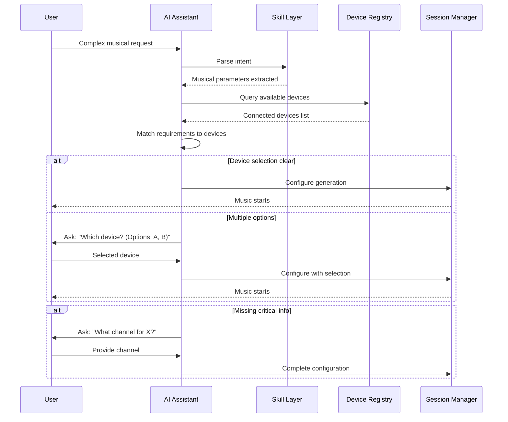

# SqncR Skills Reference

**Complete catalog of all skills available in SqncR**

Skills are discrete, composable, stateless capabilities that can be called by the AI assistant to perform specific tasks. Each skill is focused on a single responsibility and can be combined to create complex musical workflows.

**Total Skills Documented:** 43+ (general + device-specific + conversational)

---

## Table of Contents

- [Musical Intelligence Skills](#musical-intelligence-skills)
- [Device Control Skills](#device-control-skills)
- [Analysis Skills](#analysis-skills)
- [Generation Skills](#generation-skills)
- [Transformation Skills](#transformation-skills)
- [Session Management Skills](#session-management-skills)
- [Utility Skills](#utility-skills)
- [Device-Specific Skills](#device-specific-skills)
- [Conversational Intelligence & Device Awareness](#conversational-intelligence--device-awareness)
- [Future Skills](#future-skills)

---

## Musical Intelligence Skills

### skill-vibe-to-music
**Translate abstract concepts to musical parameters**

**Sample Prompts:**
- *"make it darker"*
- *"I want it to sound like Rothko makes you feel"*
- *"give it a film noir vibe"*
- *"make it brighter and more uplifting"*

```yaml
name: Vibe-to-Music
description: Converts artistic, emotional, or abstract concepts into concrete musical parameters
inputs:
  concept: string  # "darker", "like Rothko", "film noir", "sunrise"
  current_musical_context: object (optional)
outputs:
  mode: string  # e.g., "phrygian", "lydian"
  harmonic_rhythm: string  # "very_slow", "moderate", "fast"
  chord_extensions: boolean
  density: number  # 0-1
  brightness: number  # -1 to 1
  velocity_offset: number  # -50 to 50
  voicing: string  # "lower", "higher", "wide", "close"
  timbre_suggestions: array
  reasoning: string
```

**Examples:**
```
Input: "darker"
Output: {
  mode: "phrygian",
  brightness: -0.3,
  velocity_offset: -15,
  voicing: "lower",
  reasoning: "Phrygian mode creates darker mood through flatted 2nd"
}

Input: "make it sound like Rothko"
Output: {
  mode: "dorian",
  harmonic_rhythm: "very_slow",
  chord_extensions: true,
  density: 0.2,
  timbre: "warm_blurred",
  reasoning: "Rothko's color fields = sustained spacious chords"
}

Input: "sunrise"
Output: {
  mode: "lydian",
  brightness: 0.5,
  voicing: "higher",
  harmonic_rhythm: "moderate",
  reasoning: "Lydian's raised 4th creates bright, uplifting quality"
}
```

### skill-chord-progression
**Generate harmonically sophisticated chord progressions**

**Sample Prompts:**
- *"generate a dark minor progression in A minor, 4 bars"*
- *"create a jazzy chord progression with lots of extensions"*
- *"give me something ambient with slow chord changes"*
- *"build a progression that creates tension"*

```yaml
name: Chord Progression Generator
description: Creates chord progressions based on music theory principles
inputs:
  key: string  # "C", "A", "F#"
  mode: string  # "major", "minor", "dorian", "phrygian", etc.
  vibe: string  # "dark", "bright", "tense", "resolved", "jazzy"
  bars: number  # number of bars
  complexity: number  # 0-10
  style: string (optional)  # "jazz", "classical", "ambient", "pop"
outputs:
  progression: array  # [{ chord: "Am7", function: "i", bar: 1 }]
  voice_leadings: array  # smooth voice leading between chords
  tension_curve: array  # tension values for each chord
  reasoning: string
```

**Examples:**
```
Input: { key: "A", mode: "minor", vibe: "dark", bars: 4 }
Output: {
  progression: [
    { chord: "Am7", function: "i", bar: 1, tension: 0.2 },
    { chord: "Dm7", function: "iv", bar: 2, tension: 0.4 },
    { chord: "Fmaj7", function: "VI", bar: 3, tension: 0.6 },
    { chord: "E7", function: "V", bar: 4, tension: 0.8 }
  ],
  reasoning: "i-iv-VI-V progression with tension building to dominant"
}
```

### skill-voice-leading
**Optimize chord voicings for smooth transitions**

**Sample Prompts:**
- *"optimize the voice leading for smoother transitions"*
- *"make these chord changes sound more connected"*
- *"voice these chords with minimal movement"*

```yaml
name: Voice Leading Optimizer
description: Creates smooth voice leading between chords
inputs:
  chords: array  # array of chord symbols
  range: [number, number]  # MIDI note range [low, high]
  instrument_type: string  # "piano", "synth", "guitar", "strings"
  previous_voicing: array (optional)  # for continuity
outputs:
  voicings: array  # array of note arrays [[60, 64, 67], ...]
  movement: array  # distance each voice moved
  common_tones: array  # which notes stayed the same
```

**Examples:**
```
Input: {
  chords: ["Cmaj7", "Fmaj7"],
  range: [48, 72],
  instrument_type: "synth"
}
Output: {
  voicings: [
    [60, 64, 67, 71],  // C E G B (Cmaj7)
    [60, 65, 69, 72]   // C F A C (Fmaj7)
  ],
  movement: [0, 1, 2, 1],  // semitones each voice moved
  common_tones: [60]  // C is common tone
}
```

### skill-scale-selector
**Select appropriate scale for given musical context**

**Sample Prompts:**
- *"what scale should I use for a mysterious mood in D?"*
- *"suggest a scale for sad jazz in F minor"*
- *"pick a scale that sounds exotic"*

```yaml
name: Scale Selector
description: Chooses optimal scale based on mood, genre, and context
inputs:
  key: string
  mood: string  # "happy", "sad", "mysterious", "tense"
  genre: string (optional)  # "jazz", "ambient", "rock"
  context: string (optional)  # additional context
outputs:
  scale: string  # scale name
  notes: array  # scale notes as MIDI numbers
  characteristics: object
  reasoning: string
```

### skill-harmonic-analysis
**Analyze harmonic relationships and functions**

**Sample Prompts:**
- *"analyze the harmonic function of these chords"*
- *"what are the borrowed chords in this progression?"*
- *"where are the modulations in this sequence?"*

```yaml
name: Harmonic Analyzer
description: Analyzes chords and their relationships
inputs:
  chords: array  # chord progression
  key: string
outputs:
  functions: array  # roman numeral analysis
  borrowed_chords: array  # chords from outside key
  modulations: array  # key changes detected
  tension_points: array
```

---

## Device Control Skills

### skill-list-devices
**List all available MIDI devices**

**Sample Prompts:**
- *"list my midi devices"*
- *"what MIDI hardware do I have connected?"*
- *"show me all available devices"*

**How MIDI Device Names Work:**
When scanning MIDI devices, the operating system returns both the **device name** (as reported by the device/driver) and an **index** (port number). This means users can reference devices by name directly without manual configuration.

```yaml
name: List MIDI Devices
description: Scans and returns all connected MIDI devices with names and indices
inputs: none
outputs:
  devices: array  # array of device objects with names and indices
```

**Output Format:**
```json
{
  "devices": [
    {
      "index": 0,
      "port_name": "Polyend Synth MIDI 1",  // OS-reported name
      "manufacturer": "Polyend",
      "profile_match": "polyend-synth",  // matched to SqncR profile
      "type": "synth",
      "channels": [1, 2, 3],  // from profile
      "polyphony": 8,
      "status": "connected",
      "capabilities": ["note_on", "note_off", "cc", "aftertouch"]
    },
    {
      "index": 1,
      "port_name": "Moog Mother-32",  // OS-reported name
      "manufacturer": "Moog",
      "profile_match": "moog-mother32",
      "type": "synth",
      "channels": [1],  // user configurable
      "polyphony": 1,
      "status": "connected",
      "capabilities": ["note_on", "note_off", "cc", "pitchbend"]
    },
    {
      "index": 2,
      "port_name": "MAFD",  // Sonoclast MAFD USB
      "manufacturer": "Sonoclast",
      "profile_match": "sonoclast-mafd",
      "controls_device": "moog-dfam",
      "type": "controller",
      "status": "connected"
    },
    {
      "index": 3,
      "port_name": "Polyend MESS",
      "manufacturer": "Polyend",
      "profile_match": "polyend-mess",
      "type": "fx",
      "channels": [1],
      "status": "connected"
    }
  ]
}
```

**This means users can say:**
- *"use the Polyend Synth"* (AI matches to index 0, "Polyend Synth MIDI 1")
- *"play bass on the Moog Mother-32"* (AI matches to index 1)
- *"trigger the DFAM"* (AI knows to use MAFD at index 2)
- *"use the MESS"* (AI matches to index 3, "Polyend MESS")

**Automatic Name Matching:**
```csharp
// Device registry can match fuzzy names
var device = deviceRegistry.FindByName("polyend synth");
// Matches: "Polyend Synth MIDI 1" at index 0

var device = deviceRegistry.FindByName("moog");
// Matches: "Moog Mother-32" at index 1

var device = deviceRegistry.FindByName("mess");
// Matches: "Polyend MESS" at index 3
```

**Profile Matching:**
SqncR maintains device profiles (polyend-synth, moog-mother32, etc.) and automatically matches them to connected devices by name pattern recognition. When a device is detected:

1. Get device name from OS (e.g., "Polyend Synth MIDI 1")
2. Match to profile (polyend-synth) using pattern matching
3. Load profile capabilities (channels, polyphony, roles)
4. User can reference by any reasonable name variation

**Channel Configuration:**
While device name and index come from MIDI spec, **channel assignments** are user-configurable:
- Stored in `~/.sqncr/config.json` or session state
- User can say: *"set the Moog to channel 4"*
- Or detected from first usage: *"play bass on Moog channel 4"*
- Remembered for future sessions

### skill-device-selector
**Select optimal device for musical role**

**Sample Prompts:**
- *"pick the best device for bass"*
- *"which synth should handle the pads?"*
- *"choose something analog and warm for the bassline"*
- *"what device is best for glitchy textures?"*

```yaml
name: Device Selector
description: Chooses best device based on role and characteristics
inputs:
  role: string  # "bass", "chords", "pads", "lead", "drums", "texture", "fx"
  characteristics: array  # ["warm", "analog", "bright", "digital"]
  available_devices: array
  exclude_devices: array (optional)
outputs:
  selected_device: object
  channel: number
  reasoning: string
```

**Examples:**
```
Input: {
  role: "bass",
  characteristics: ["warm", "analog", "fat"]
}
Output: {
  selected_device: "moog-mother32-001",
  channel: 4,
  reasoning: "Moog Mother-32's analog warmth perfect for bass foundation"
}

Input: {
  role: "texture",
  characteristics: ["glitchy", "experimental"]
}
Output: {
  selected_device: "polyend-mess-001",
  channel: 5,
  reasoning: "MESS FX sequencer ideal for glitchy textural elements"
}
```

### skill-send-midi
**Send MIDI messages to devices**

**Sample Prompts:**
- *"send a C4 note to the Polyend on channel 1"*
- *"play an Am7 chord on the Moog"*
- *"send program change 5 to the MESS"*

```yaml
name: Send MIDI Message
description: Sends MIDI messages with OpenTelemetry tracing
inputs:
  device: string
  channel: number
  message_type: string  # "note_on", "note_off", "cc", "program_change"
  data: object
outputs:
  success: boolean
  latency_ms: number
```

### skill-configure-midi-routing
**Set up MIDI routing between devices**

**Sample Prompts:**
- *"route MIDI from channel 1 to channel 4"*
- *"send my keyboard input to both the Polyend and Moog"*
- *"set up MIDI thru from the Play+ to the MESS"*

```yaml
name: Configure MIDI Routing
description: Routes MIDI between devices for complex setups
inputs:
  source_device: string
  destination_device: string
  channel_map: object  # { 1: 2, 2: 3 } maps source ch to dest ch
  filter: object (optional)  # filter certain message types
outputs:
  routing_id: string
  configuration: object
```

---

## Analysis Skills

### skill-analyze-song
**Extract musical data from song descriptions or audio**

**Sample Prompts:**
- *"analyze that Cream song from The Breakfast Club"*
- *"what key and tempo is Pyramid Song by Radiohead?"*
- *"extract the chord progression from Blue in Green"*
- *"tell me about the harmonic structure of this track"*
- *"start with an aphex twin-like heartbeat-style bassline that isn't too thumpy"*

**Conversational Flow:**
```
User: "start with an aphex twin-like heartbeat-style bassline that isn't too thumpy"

AI calls skill-analyze-song → identifies Aphex Twin characteristics:
- Broken beat, IDM style
- Sub-bass focus, not aggressive
- Irregular rhythms
- 808-style but more subdued

AI: "I can create that Aphex Twin heartbeat bass. You have:
     1. Moog Mother-32 (warm analog, perfect for sub-bass)
     2. Polyend Synth Ch1 (versatile, can do 808-style)
     Which would you prefer?"

User: "the Moog"

AI: "Great. What MIDI channel is the Mother-32 on?"

User: "channel 4"

AI calls skill-bass-line-generator with:
- style: "aphex_twin_heartbeat"
- thumpy: false (subdued)
- device: "moog-mother32-001"
- channel: 4

Music starts playing
```

```yaml
name: Song Analyzer
description: Identifies songs and extracts musical parameters
inputs:
  song_description: string  # "that Cream song from The Breakfast Club"
  reference_audio: string (optional)  # URL or file path
  analysis_depth: string  # "basic", "detailed", "complete"
outputs:
  song_title: string
  artist: string
  key: string
  tempo: number
  time_signature: string
  chord_progression: array
  melody_notes: array (optional)
  vibe_tags: array
  spotify_url: string (optional)
  reasoning: string
```

**Examples:**
```
Input: "that Cream song from The Breakfast Club"
Output: {
  song_title: "I'm So Glad",
  artist: "Cream",
  key: "E",
  mode: "mixolydian/blues",
  tempo: 140,
  time_signature: "4/4",
  feel: "shuffle",
  main_riff: [64, 67, 69, 70, 71, 74],  // E blues scale
  chord_progression: ["E7"],
  vibe_tags: ["driving", "raw", "blues", "garage_rock"],
  reasoning: "Modal blues rock with shuffle feel and E7 vamp"
}
```

### skill-detect-key
**Detect key from MIDI input or audio**

**Sample Prompts:**
- *"listen and detect what key I'm playing in"*
- *"what key is this in?"*
- *"analyze the key from my MIDI input"*

```yaml
name: Key Detector
description: Analyzes notes to determine key and mode
inputs:
  notes: array  # MIDI note numbers
  duration_seconds: number (optional)
outputs:
  key: string
  mode: string
  confidence: number  # 0-1
  alternatives: array  # other possible keys
```

### skill-detect-tempo
**Detect tempo from MIDI input or audio**

**Sample Prompts:**
- *"what tempo am I playing?"*
- *"detect the BPM from this recording"*
- *"analyze the tempo from my performance"*

```yaml
name: Tempo Detector
description: Analyzes timing to determine tempo
inputs:
  midi_events: array
  time_window_seconds: number
outputs:
  tempo: number  # BPM
  confidence: number
  time_signature: string (optional)
```

### skill-analyze-harmony
**Analyze harmonic content of MIDI input**

**Sample Prompts:**
- *"what chord am I playing right now?"*
- *"analyze the harmony of this section"*
- *"identify these chord extensions"*
- *"what notes would complement what I'm playing?"*

```yaml
name: Harmony Analyzer
description: Real-time harmonic analysis of playing
inputs:
  notes: array  # currently playing notes
  context: object  # previous harmonic context
outputs:
  current_chord: string
  chord_quality: string
  extensions: array
  function: string  # "tonic", "dominant", "subdominant"
  suggestions: array  # complementary notes
```

---

## Generation Skills

### skill-polyrhythm-generator
**Create complex polyrhythmic patterns**

**Sample Prompts:**
- *"add some polyrhythms, 3 against 4"*
- *"create a polyrhythmic layer"*
- *"generate 5 against 4 patterns across bass and chords"*
- *"make it more polyrhythmic"*

```yaml
name: Polyrhythm Generator
description: Generates mathematically interesting rhythmic patterns
inputs:
  base_tempo: number
  time_signature: string
  complexity: number  # 2-7 (e.g., 3 against 4)
  instruments: array
  duration_bars: number
outputs:
  patterns: array  # rhythmic sequences per instrument
  sync_points: array  # where patterns align
  lcm: number  # least common multiple (cycle length)
```

**Examples:**
```
Input: {
  base_tempo: 87,
  time_signature: "4/4",
  complexity: 3,  // 3 against 4
  instruments: ["bass", "chords"]
}
Output: {
  patterns: {
    bass: [0, 1000, 2000, 3000],  // quarter notes
    chords: [0, 1333, 2666]  // dotted quarter notes (3 in 4 beats)
  },
  sync_points: [0, 4000],  // patterns align every 4 beats
  lcm: 12  // pattern repeats every 12 eighth notes
}
```

### skill-arpeggio-generator
**Generate arpeggiated patterns**

**Sample Prompts:**
- *"arpeggiate this chord upward"*
- *"create an up-down arpeggio pattern over 2 octaves"*
- *"add arpeggiated chords to the background"*

```yaml
name: Arpeggio Generator
description: Creates arpeggio patterns from chords
inputs:
  chord: string
  pattern: string  # "up", "down", "up-down", "random", "as-played"
  octaves: number
  note_duration: string  # "16th", "8th", "triplet"
  velocity_curve: string  # "flat", "crescendo", "diminuendo"
outputs:
  notes: array  # sequence of MIDI notes with timing
  pattern_length: number  # in beats
```

### skill-bass-line-generator
**Generate walking bass lines**

**Sample Prompts:**
- *"generate a walking bass line for this progression"*
- *"create a sparse bass pattern"*
- *"add a rhythmic bass line"*
- *"give me a bass line that follows the chords"*

```yaml
name: Bass Line Generator
description: Creates bass lines that follow chord progressions
inputs:
  chord_progression: array
  style: string  # "walking", "pedal", "rhythmic", "sparse"
  complexity: number  # 0-10
  range: [number, number]  # MIDI note range
outputs:
  bass_line: array  # notes with timing and duration
  approach_notes: array  # chromatic approaches used
```

### skill-melody-generator
**Generate melodic lines**

**Sample Prompts:**
- *"create a melody over this progression"*
- *"generate a stepwise melodic line"*
- *"give me a memorable melodic phrase"*
- *"improvise a melody using mostly leaps"*

```yaml
name: Melody Generator
description: Creates melodies based on scale and style
inputs:
  scale: array  # scale notes
  chord_progression: array
  style: string  # "stepwise", "leaps", "motivic", "random"
  phrase_length_bars: number
  range: [number, number]
outputs:
  melody: array  # notes with timing, duration, velocity
  motifs: array  # recurring melodic fragments
  contour: string  # "ascending", "descending", "arch", "wave"
```

### skill-rhythm-generator
**Generate rhythmic patterns**

**Sample Prompts:**
- *"create a swing rhythm pattern"*
- *"generate syncopated drums"*
- *"give me a shuffle feel"*
- *"make a sparse rhythmic pattern"*

```yaml
name: Rhythm Generator
description: Creates rhythmic patterns for drums/percussion
inputs:
  style: string  # "straight", "swing", "shuffle", "syncopated"
  density: number  # 0-1
  tempo: number
  time_signature: string
  bars: number
outputs:
  pattern: array  # hit timing and velocity
  groove: string  # groove classification
```

---

## Transformation Skills

### skill-transpose
**Transpose notes or progressions**

**Sample Prompts:**
- *"transpose this up a fifth"*
- *"move everything down 3 semitones"*
- *"transpose to the key of E"*

```yaml
name: Transposer
description: Transposes musical content to different key
inputs:
  notes: array  # MIDI notes or chord symbols
  semitones: number  # -12 to 12
  maintain_octave: boolean
outputs:
  transposed: array
  new_key: string (optional)
```

### skill-invert-chord
**Invert chord voicings**

**Sample Prompts:**
- *"invert this chord"*
- *"play this in first inversion"*
- *"voice this chord with the 3rd in the bass"*

```yaml
name: Chord Inverter
description: Creates different inversions of chords
inputs:
  chord: string
  inversion: number  # 0 (root), 1 (first), 2 (second)
  octave: number
outputs:
  notes: array
  bass_note: number
```

### skill-quantize
**Quantize timing to grid**

**Sample Prompts:**
- *"quantize this to 16th notes"*
- *"tighten up the timing"*
- *"quantize with 50% strength and some swing"*

```yaml
name: Quantizer
description: Aligns notes to rhythmic grid
inputs:
  notes: array  # notes with timing
  grid: string  # "16th", "8th", "quarter"
  strength: number  # 0-1 (0 = no quantize, 1 = hard quantize)
  swing: number  # 0-100%
outputs:
  quantized_notes: array
```

### skill-humanize
**Add human-like timing variations**

**Sample Prompts:**
- *"humanize the timing"*
- *"make it feel less robotic"*
- *"add some natural variation to the performance"*

```yaml
name: Humanizer
description: Adds natural timing and velocity variations
inputs:
  notes: array
  timing_variance: number  # milliseconds
  velocity_variance: number  # 0-127
  style: string  # "subtle", "moderate", "drunk"
outputs:
  humanized_notes: array
```

### skill-modal-interchange
**Borrow chords from parallel modes**

**Sample Prompts:**
- *"suggest some borrowed chords to make this darker"*
- *"what chords can I borrow from the parallel minor?"*
- *"add some modal interchange for more color"*

```yaml
name: Modal Interchange
description: Suggests chords borrowed from parallel keys/modes
inputs:
  key: string
  mode: string
  target_mood: string  # "darker", "brighter", "more_complex"
outputs:
  borrowed_chords: array
  from_mode: string
  usage_suggestions: array
```

---

## Session Management Skills

### skill-save-session
**Save current session state**

**Sample Prompts:**
- *"save this session as 'ambient drone 1'"*
- *"save what we're doing right now"*
- *"remember this setup"*

```yaml
name: Save Session
description: Persists current musical session
inputs:
  session_name: string
  include_history: boolean
outputs:
  session_id: string
  file_path: string
  timestamp: string
```

### skill-load-session
**Load previous session**

**Sample Prompts:**
- *"load session 'ambient drone 1'"*
- *"restore my last session"*
- *"bring back that setup from yesterday"*

```yaml
name: Load Session
description: Restores saved musical session
inputs:
  session_id: string
outputs:
  session: object
  devices: array
  musical_context: object
```

### skill-list-sessions
**List all saved sessions**

**Sample Prompts:**
- *"what sessions have I saved?"*
- *"show me my saved setups"*
- *"list all my previous sessions"*

```yaml
name: List Sessions
description: Returns all available saved sessions
inputs: none
outputs:
  sessions: array  # session metadata
```

### skill-export-midi
**Export generation as MIDI file**

**Sample Prompts:**
- *"export this as a MIDI file"*
- *"save the last 8 bars as MIDI"*
- *"export this session to 'ambient_track.mid'"*

```yaml
name: MIDI File Exporter
description: Exports current or generated music as MIDI file
inputs:
  session_id: string (optional)
  file_path: string
  include_devices: array (optional)
  start_bar: number (optional)
  end_bar: number (optional)
outputs:
  file_path: string
  duration_seconds: number
  track_count: number
```

---

## Utility Skills

### skill-configure-lights
**Configure MIDI-controlled lighting**

**Sample Prompts:**
- *"sync the lights to the beat"*
- *"map chord changes to color shifts"*
- *"set up lights to follow the intensity"*

```yaml
name: Light Show Configurator
description: Maps musical events to MIDI lighting control
inputs:
  tempo: number
  intensity: number  # 0-10
  color_mapping: object  # harmonic events → colors
  sync_mode: string  # "beat", "chord_change", "dynamic"
outputs:
  light_configuration: object
  cc_mappings: array
```

### skill-calculate-interval
**Calculate interval between notes**

**Sample Prompts:**
- *"what interval is between C and G?"*
- *"calculate the interval from MIDI note 60 to 67"*

```yaml
name: Interval Calculator
description: Determines musical interval between two notes
inputs:
  note1: number  # MIDI note
  note2: number  # MIDI note
outputs:
  interval: string  # "perfect fifth", "minor third"
  semitones: number
  quality: string  # "perfect", "major", "minor", "augmented", "diminished"
```

### skill-note-to-frequency
**Convert MIDI note to frequency**

**Sample Prompts:**
- *"what frequency is A4?"*
- *"convert MIDI note 60 to Hz"*

```yaml
name: Note to Frequency Converter
description: Converts MIDI note numbers to Hz
inputs:
  note: number  # MIDI note (0-127)
  tuning: number  # A4 frequency (default 440Hz)
outputs:
  frequency: number  # Hz
  note_name: string
```

### skill-tempo-tap
**Calculate tempo from tap input**

**Sample Prompts:**
- *"tap tempo for me"*
- *"I'll tap the beat, you figure out the BPM"*
- *"detect tempo from my tapping"*

```yaml
name: Tempo Tap
description: Determines tempo from user tapping
inputs:
  tap_timestamps: array  # millisecond timestamps
  min_taps: number  # minimum taps to calculate (default 4)
outputs:
  tempo: number  # BPM
  confidence: number
  variance: number
```

---

## Skill Combinations

Skills are designed to be composed together for complex operations:

### Example: "Create Jazz Comp for Solo"
```
1. skill-detect-key (from user's solo input)
2. skill-chord-progression (jazz style, detected key)
3. skill-voice-leading (jazz voicings)
4. skill-rhythm-generator (swing feel)
5. skill-device-selector (piano for comping)
6. skill-send-midi (play the comp)
```

### Example: "Build Tension Over 2 Minutes"
```
1. skill-vibe-to-music ("building tension")
2. skill-chord-progression (increasing complexity)
3. skill-polyrhythm-generator (add layers)
4. skill-device-selector (orchestrate across devices)
5. skill-humanize (natural feel)
6. skill-configure-lights (visual tension)
```

### Example: "Recreate That Song's Vibe"
```
1. skill-analyze-song (identify and extract)
2. skill-scale-selector (matching mood)
3. skill-chord-progression (similar harmonic movement)
4. skill-bass-line-generator (similar style)
5. skill-rhythm-generator (matching feel)
```

---

## Implementation Notes

**Skill Structure (C#):**
```csharp
public interface ISkill
{
    string Name { get; }
    string Description { get; }
    Task<SkillResult> ExecuteAsync(SkillInput input, CancellationToken cancellationToken);
}

public abstract class SkillBase : ISkill
{
    protected readonly ActivitySource ActivitySource;
    protected readonly ILogger Logger;
    
    // OpenTelemetry tracing built-in
    public async Task<SkillResult> ExecuteAsync(SkillInput input, CancellationToken cancellationToken)
    {
        using var activity = ActivitySource.StartActivity($"Skill.{Name}");
        activity?.SetTag("skill.name", Name);
        activity?.SetTag("skill.input", JsonSerializer.Serialize(input));
        
        try
        {
            var result = await ExecuteInternalAsync(input, cancellationToken);
            activity?.SetTag("skill.success", true);
            return result;
        }
        catch (Exception ex)
        {
            activity?.RecordException(ex);
            throw;
        }
    }
    
    protected abstract Task<SkillResult> ExecuteInternalAsync(SkillInput input, CancellationToken cancellationToken);
}
```

**Registering Skills:**
```csharp
// Startup.cs or Program.cs
services.AddSingleton<ISkill, VibeToMusicSkill>();
services.AddSingleton<ISkill, ChordProgressionSkill>();
services.AddSingleton<ISkill, DeviceSelectorSkill>();
services.AddSingleton<ISkill, AnalyzeSongSkill>();
// ... etc

services.AddSingleton<ISkillRegistry, SkillRegistry>();
```

**Calling from MCP Server:**
```csharp
var skill = skillRegistry.GetSkill("vibe-to-music");
var result = await skill.ExecuteAsync(new SkillInput
{
    Parameters = new Dictionary<string, object>
    {
        ["concept"] = "darker",
        ["current_musical_context"] = currentContext
    }
});
```

---

## Device-Specific Skills

These skills target specific devices in your studio for specialized control.

### skill-polyend-synth-engine-select
**Select and configure Polyend Synth engines**

**Sample Prompts:**
- *"set Polyend engine 1 to wavetable synthesis"*
- *"configure the Polyend engines: bass on 1, pads on 2, lead on 3"*
- *"switch Polyend channel 2 to granular mode"*

```yaml
name: Polyend Synth Engine Selector
description: Configure the 3 engines on Polyend Synth
inputs:
  engine: number  # 1, 2, or 3
  synthesis_type: string  # "wavetable", "granular", "fm", "va", "physical_modeling"
  role: string  # "bass", "chords", "pads", "lead"
  channel: number
outputs:
  configuration: object
  voice_allocation: number
```

### skill-polyend-mess-preset
**Control Polyend MESS presets and sequencer**

**Sample Prompts:**
- *"switch MESS to preset 12"*
- *"activate the MESS sequencer"*
- *"set MESS to lofi degradation mode"*
- *"randomize MESS parameters"*

```yaml
name: Polyend MESS Controller
description: Control MESS FX pedal via MIDI
inputs:
  action: string  # "preset", "parameter", "sequencer"
  preset_number: number (optional)  # 0-127
  parameters: object (optional)  # CC mappings
  sequencer_control: string (optional)  # "start", "stop", "sync"
outputs:
  midi_messages: array
  current_state: object
```

### skill-polyend-play-pattern
**Control Polyend Play+ patterns and tracks**

**Sample Prompts:**
- *"trigger pattern A on the Play+"*
- *"set Play+ track 3 to play a kick drum pattern"*
- *"load a different sample on Play+ track 8"*
- *"sync Play+ sequencer to our tempo"*

```yaml
name: Polyend Play+ Controller
description: Control Play+ sampler/sequencer
inputs:
  action: string  # "pattern", "track", "sample", "sync"
  track: number (optional)  # 1-16
  pattern: string (optional)
  sample_slot: number (optional)
outputs:
  configuration: object
  active_tracks: array
```

### skill-moog-mother32-sequence
**Program Moog Mother-32's internal sequencer**

**Sample Prompts:**
- *"program a sequence into the Mother-32"*
- *"set Mother-32 to play this melodic pattern"*
- *"create a 16-step sequence on the Moog"*

```yaml
name: Moog Mother-32 Sequencer
description: Program Mother-32's built-in sequencer via MIDI
inputs:
  notes: array  # up to 32 steps
  gate_lengths: array (optional)
  cv_modulation: array (optional)
outputs:
  sequence_data: object
  sequence_length: number
```

### skill-moog-dfam-pattern
**Control Moog DFAM via MAFD adapter**

**Sample Prompts:**
- *"trigger DFAM step 3"*
- *"play a pattern on the DFAM using steps 1, 4, 5, 8"*
- *"send velocity modulation to the DFAM"*
- *"create a drum pattern on the DFAM"*

```yaml
name: Moog DFAM Controller (via MAFD)
description: Control DFAM's 8 steps via Sonoclast MAFD
inputs:
  steps: array  # which of 8 steps to trigger (1-8)
  velocity: array  # velocity per step (0-127)
  pressure: array (optional)  # aftertouch/modulation per step
  pattern: array (optional)  # rhythmic pattern
outputs:
  midi_notes: array  # 8 adjacent notes mapped to steps
  cv_values: object  # velocity/pressure CV outputs
```

### skill-mess-glitch-automation
**Automate Polyend MESS for glitch effects**

**Sample Prompts:**
- *"automate the MESS to create glitchy accents"*
- *"have the MESS add random stutters"*
- *"modulate MESS parameters over time"*
- *"create chaotic variations with the MESS"*

```yaml
name: MESS Glitch Automator
description: Automated parameter modulation for MESS pedal
inputs:
  automation_style: string  # "random", "rhythmic", "build", "chaotic"
  parameters: array  # which parameters to modulate
  intensity: number  # 0-10
  sync_to_beat: boolean
outputs:
  cc_automation: array  # CC messages over time
  sequencer_pattern: object (optional)
```

### skill-polyend-synth-aftertouch
**Control Polyend Synth expression via aftertouch**

**Sample Prompts:**
- *"add aftertouch modulation to the Polyend pads"*
- *"use pressure to control filter cutoff"*
- *"enable polyphonic aftertouch on the Polyend"*

```yaml
name: Polyend Synth Aftertouch Controller
description: Configure channel and poly aftertouch
inputs:
  mode: string  # "channel", "polyphonic"
  modulation_target: string  # "filter", "vibrato", "volume"
  amount: number  # 0-127
outputs:
  aftertouch_config: object
  midi_mapping: object
```

### skill-mother32-cv-routing
**Configure Moog Mother-32 CV outputs**

**Sample Prompts:**
- *"use Mother-32's CV out to control external modules"*
- *"route Mother-32 gate to trigger the DFAM"*
- *"send Mother-32's velocity CV to another device"*

```yaml
name: Mother-32 CV Router
description: Configure CV/Gate outputs for modular integration
inputs:
  cv_source: string  # "pitch", "velocity", "mod", "assign"
  destination: string  # external device/module
  scaling: number (optional)
outputs:
  routing_config: object
  note: string  # CV outputs are hardware, MIDI just triggers
```

### skill-play-plus-track-mute
**Mute/unmute tracks on Polyend Play+**

**Sample Prompts:**
- *"mute tracks 5-8 on the Play+"*
- *"unmute the kick track"*
- *"solo track 3 on Play+"*
- *"mute everything except drums"*

```yaml
name: Play+ Track Mute Controller
description: Control track muting on Play+
inputs:
  action: string  # "mute", "unmute", "solo"
  tracks: array  # track numbers
outputs:
  track_states: object
  active_tracks: array
```

### skill-mess-sequencer-pattern
**Program patterns into MESS's step sequencer**

**Sample Prompts:**
- *"program a 16-step pattern into the MESS"*
- *"set MESS sequencer to alternate between two presets"*
- *"create a glitch pattern on the MESS every 4 bars"*

```yaml
name: MESS Sequencer Programmer
description: Program MESS's 16-step sequencer
inputs:
  steps: array  # 16 steps with parameter values
  tempo_sync: boolean
  loop_mode: string  # "forward", "reverse", "pendulum", "random"
outputs:
  sequencer_data: object
  pattern_length: number
```

---

## Conversational Intelligence & Device Awareness

SqncR's AI assistant should intelligently guide conversations, asking clarifying questions when needed while leveraging knowledge of connected devices.

### Principle: Smart Defaults + Clarifying Questions

**When User Says:** *"start with an aphex twin-like heartbeat-style bassline that isn't too thumpy"*

**AI Should:**
1. ✅ **Understand the intent** (Aphex Twin = IDM, broken beat, sub-bass)
2. ✅ **Know what devices are available** (already scanned at session start)
3. ✅ **Suggest best device** based on characteristics
4. ✅ **Ask only necessary questions** (channel, if not already configured)
5. ✅ **Use defaults when reasonable** (tempo, key if not specified)

**Conversational Flow Pattern:**



### Example Conversations

#### Scenario 1: Smart Device Suggestion

```
User: "start with an aphex twin-like heartbeat-style bassline 
       that isn't too thumpy"

AI Analysis (using skill-analyze-song + skill-device-selector):
- Musical style: Aphex Twin, IDM, broken beat
- Role needed: Bass
- Character: Subdued sub-bass, "heartbeat" rhythm, not aggressive
- Tempo: ~95 BPM (typical Aphex Twin IDM tempo)
- Looks up connected devices via skill-list-devices
- Finds: Moog Mother-32 (analog, warm), Polyend Synth (versatile)
- Best match: Moog Mother-32 (focused sub-bass character)

AI: "Perfect for an Aphex Twin heartbeat bass. I'd suggest the 
     Moog Mother-32 (warm analog sub-bass, great for that subdued 
     IDM feel). It's on channel 4. Sound good, or would you prefer 
     the Polyend Synth?"

User: "the Moog works"

AI: "Great. Starting Aphex Twin-style heartbeat bass on 
     Moog Mother-32, channel 4. I'll use C minor at 95 BPM 
     with irregular rhythm patterns. Want a different key or tempo?"

User: "nah that's perfect"

[Music starts playing]
```

#### Scenario 2: User Specifies Everything

```
User: "polyend synth channel 1, dark drone in A Phrygian, 60 BPM"

AI Analysis:
- Device specified: Polyend Synth
- Channel specified: 1
- Musical: A Phrygian, 60 BPM, drone
- No questions needed!

AI: "Starting dark drone on Polyend Synth channel 1, 
     A Phrygian, 60 BPM."

[Music starts immediately]
```

#### Scenario 3: Progressive Questioning

```
User: "play some chords"

AI Analysis (via skill-validate-request):
- Generic request
- Needs: device, channel, key, type of chords
- Has: connected devices list

AI: "I can do that. You have:
     - Polyend Synth (channels 1-3)
     - Moog Mother-32 (channel 4, monophonic)
     
     The Polyend can handle polyphonic chords.
     Which channel? (Or I can default to channel 2)"

User: "channel 2 is fine"

AI: "Great. What style - ambient, jazzy, simple triads?"

User: "jazzy"

AI: "Jazz chords on Polyend channel 2. Key?"

User: "Bb major"

AI: "Playing jazz voicings in Bb major, moderate tempo. 
     I'll use some extensions (7ths, 9ths)."

[Music starts]
```

#### Scenario 4: Intelligent Device Selection

```
User: "I want glitchy accents on every fourth beat"

AI Analysis:
- Requirement: Glitchy, rhythmic accents
- Best device: Polyend MESS (FX pedal with glitch capabilities)
- Checks: Is MESS configured?

AI: "Perfect use case for the MESS pedal! I'll trigger 
     glitchy effects on beat 4. The MESS is on channel 5.
     How intense - subtle or chaotic?"

User: "subtle"

AI: "Setting up MESS for subtle glitch accents on beat 4,
     using low-intensity parameter automation."

[MESS starts glitching subtly on beat 4]
```

#### Scenario 5: Multi-Device Orchestration

```
User: "build something over 3 minutes, start minimal, 
       get complex, then resolve"

AI Analysis:
- Structural arc specified
- No devices specified
- AI should orchestrate across available devices
- Needs: key, tempo (can default)

AI: "I'll build a 3-minute arc. Available devices:
     - Polyend Synth (versatile, 3 engines)
     - Moog Mother-32 (warm bass)
     - Polyend MESS (textures/glitch)
     - Play+ (drums/samples)
     
     My plan:
     [0:00-1:00] Mother-32 bass only (minimal)
     [1:00-2:00] Add Polyend pads, Play+ subtle percussion
     [2:00-2:30] Peak: all devices, MESS glitches, complex rhythms
     [2:30-3:00] Resolve: back to Mother-32 + Polyend pads
     
     Key preference? Or I'll default to A minor, 85 BPM."

User: "D Dorian, 78 BPM"

AI: "Perfect. Building 3-minute arc in D Dorian, 78 BPM,
     orchestrating across all devices."

[Music builds autonomously over 3 minutes]
```

### Key Principles for Conversational Intelligence

**1. Device Awareness**
```csharp
// Session initialization should query devices
var devices = await skillRegistry.GetSkill("list-devices").ExecuteAsync();

// Store in session context
sessionManager.SetAvailableDevices(devices);

// AI can reference throughout conversation
```

**2. Smart Defaults**
- **Tempo**: Default to 80-90 BPM for ambient, 120 for electronic, 140 for rock
- **Key**: Default to A minor or C major (most common)
- **Channel**: Use device's default_roles from config
- **Intensity**: Default to 5/10 (moderate)

**3. Progressive Disclosure**
Ask essential questions first, details later:
```
Essential: Device selection, key (if not defaultable from context)
Secondary: Tempo (can default), intensity
Tertiary: Specific voicings, exact parameters
```

**4. Context Retention**
```csharp
// Remember user preferences
sessionManager.RememberPreference("bass_device", "moog-mother32-001");

// Next time user says "play bass"
// AI: "Using Moog Mother-32 like last time..."
```

**5. Confirmation Before Action**
For complex operations, confirm:
```
User: "randomize everything"

AI: "That will randomize:
     - All active device parameters
     - Current chord progression
     - Tempo and key
     
     Continue? (This will change what's playing)"
```

---

## Implementation: Conversational Skills

### skill-clarify-intent
**Ask clarifying questions when request is ambiguous**

**Sample Prompts:**
- *"play something"* (too vague)
- *"make music"* (needs details)

```yaml
name: Intent Clarifier
description: Determines what questions to ask for ambiguous requests
inputs:
  user_request: string
  available_devices: array
  current_context: object
outputs:
  questions: array  # ordered list of questions to ask
  can_default: object  # what can be assumed
  critical_missing: array  # must-have information
```

**Example:**
```
Input: "play something"
Output: {
  questions: [
    "What style or mood? (ambient, jazzy, rhythmic, etc.)",
    "Which device(s)? You have Polyend, Moog, MESS, Play+"
  ],
  can_default: {
    key: "Am",
    tempo: 85,
    intensity: 5
  },
  critical_missing: ["style", "device"]
}
```

### skill-suggest-device
**Suggest device based on musical requirement**

**Sample Prompts:**
- *"what's the best device for sub-bass?"*
- *"which synth should I use for atmospheric pads?"*

```yaml
name: Device Suggester
description: Recommends device with reasoning
inputs:
  requirement: string  # musical need description
  available_devices: array
  context: object
outputs:
  suggestions: array  # ranked by suitability
  reasoning: array  # why each device fits
```

**Example:**
```
Input: "aphex twin-like heartbeat bass, not too thumpy"
Output: {
  suggestions: [
    {
      device: "moog-mother32-001",
      rank: 1,
      reasoning: "Analog warmth ideal for sub-bass, monophonic = focused",
      suitability: 0.95
    },
    {
      device: "polyend-synth-001",
      rank: 2,
      reasoning: "Versatile, can do 808-style bass, more options",
      suitability: 0.80
    }
  ]
}
```

### skill-validate-request
**Check if request is complete and actionable**

**Sample Prompts:**
- (Internal skill, called automatically)

```yaml
name: Request Validator
description: Determines if enough information to proceed
inputs:
  user_request: string
  session_context: object
  device_states: object
outputs:
  is_complete: boolean
  missing_info: array
  suggested_defaults: object
  can_proceed: boolean
```

---

## Future Skills

**Planned for future development:**

### General Skills
- `skill-style-transfer` - Apply style of one piece to another
- `skill-auto-mastering` - Adjust MIDI velocities for balanced mix
- `skill-chord-substitution` - Suggest alternate chord choices
- `skill-reharmonization` - Reharmonize existing melody
- `skill-counterpoint-generator` - Generate contrapuntal lines
- `skill-orchestration-suggester` - Suggest device/timbre assignments
- `skill-form-analyzer` - Detect song structure (verse, chorus, bridge)
- `skill-groove-extractor` - Extract rhythmic feel from audio
- `skill-scale-degrees-to-notes` - Convert scale degree notation to notes
- `skill-lyrics-to-rhythm` - Generate rhythm from lyric syllables

### Device-Specific Future Skills
- `skill-polyend-synth-macro` - Control macro parameters
- `skill-play-plus-sample-loader` - Load samples into Play+
- `skill-mess-reverb-control` - Deep control of MESS reverb parameters
- `skill-dfam-analog-modulation` - Control DFAM's analog mod paths
- `skill-multi-device-sync` - Sync multiple Polyend devices
- `skill-eurorack-integration` - Control modular systems via Mother-32

---

## Contributing New Skills

See [CONTRIBUTING.md](CONTRIBUTING.md) for:
1. Skill design principles
2. Testing requirements
3. Documentation standards
4. OpenTelemetry integration
5. PR process

**Skill Naming Convention:** `skill-[action]-[target]`
- ✅ `skill-generate-melody`
- ✅ `skill-analyze-harmony`
- ✅ `skill-transpose-notes`
- ❌ `melody-skill`
- ❌ `generate_melody`

---

## See Also

- [AGENTIC_ARCHITECTURE.md](AGENTIC_ARCHITECTURE.md) - How skills fit into the architecture
- [MUSIC_THEORY.md](MUSIC_THEORY.md) - Music theory concepts used by skills
- [OBSERVABILITY.md](OBSERVABILITY.md) - How skills are traced and monitored
