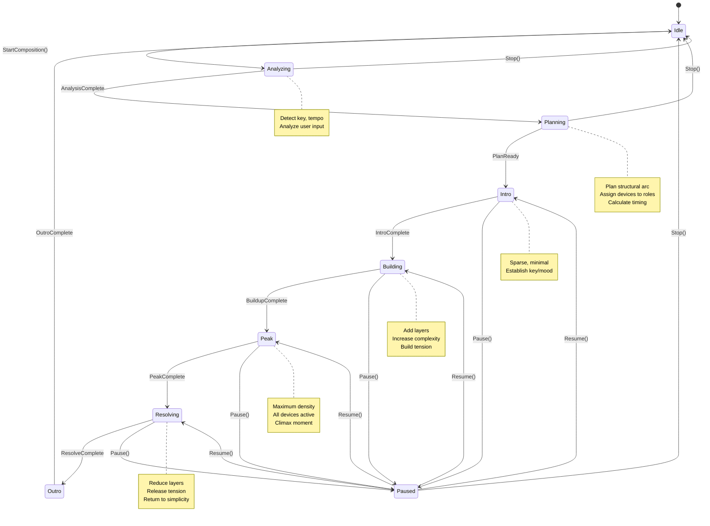
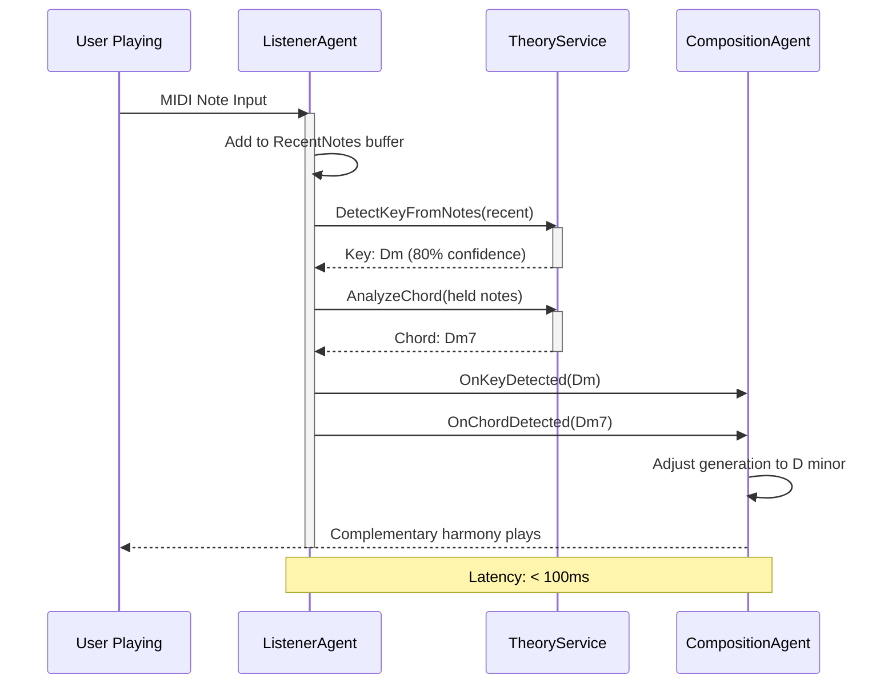

# Agent State Machines

## CompositionAgent State Machine

## ListenerAgent Real-Time Analysis

## Agent States and Transitions

### CompositionAgent States

| State | Description | Actions |
|-------|-------------|---------|
| **Idle** | No active composition | Awaiting start command |
| **Analyzing** | Analyzing user request | Parse intent, detect parameters |
| **Planning** | Planning structure | Create structural arc, assign devices |
| **Intro** | Playing introduction | Minimal, establish mood |
| **Building** | Building tension | Add layers, increase complexity |
| **Peak** | Maximum intensity | All devices, climax |
| **Resolving** | Releasing tension | Remove layers, simplify |
| **Outro** | Ending composition | Return to silence |
| **Paused** | Temporarily stopped | Can resume |

### Transitions

- **Start** - User initiates composition
- **Stop** - User stops composition (returns to Idle)
- **Pause** - Temporary suspension
- **Resume** - Continue from pause point
- **Automatic** - Phase completion triggers next phase

### Observability

All state transitions are:
- ✅ Traced with OpenTelemetry
- ✅ Tagged with current/next state
- ✅ Timed for duration in each state
- ✅ Visible in Aspire Dashboard

---

**See Also:**
- [Agentic Architecture](../AGENTIC_ARCHITECTURE.md)
- [Device Orchestration](device-orchestration.md)
