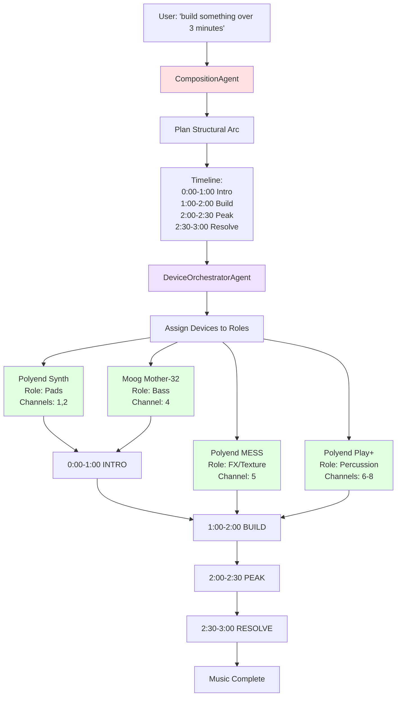
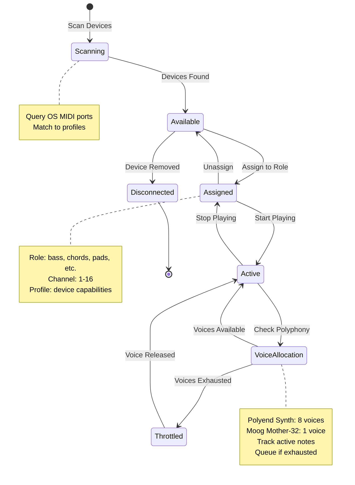

# Device Orchestration

## Multi-Device Coordination

## Device State & Voice Allocation

## Device Roles

### Musical Roles

| Role | Description | Typical Devices |
|------|-------------|-----------------|
| **Bass** | Low-frequency foundation | Moog Mother-32, Polyend Synth (bass engine) |
| **Pads** | Sustained harmonic texture | Polyend Synth (pad mode) |
| **Lead** | Melodic focus | Any synth with bright timbre |
| **Chords** | Harmonic accompaniment | Polyphonic synths |
| **Texture** | Atmospheric elements | FX processors, samplers |
| **Percussion** | Rhythmic elements | Drum machines, DFAM, Play+ |

### Orchestration Strategies

1. **Role-Based Assignment**
   - Assign devices based on their characteristics
   - Match timbre to musical role
   - Consider polyphony requirements

2. **Layer Management**
   - Intro: 1-2 devices
   - Build: Add 1 device at a time
   - Peak: All devices active
   - Resolve: Remove devices progressively

3. **Voice Allocation**
   - Track active notes per device
   - Respect polyphony limits
   - Queue notes if voices exhausted
   - Release voices intelligently

4. **Timing Coordination**
   - Synchronize across devices
   - Tempo-locked timing
   - Phase-aligned patterns
   - Coordinated stops/starts

---

**See Also:**
- [Agent State Machines](agent-state-machines.md)
- [Device Profiles](../MUSIC_THEORY.md)
- [System Overview](system-overview.md)
