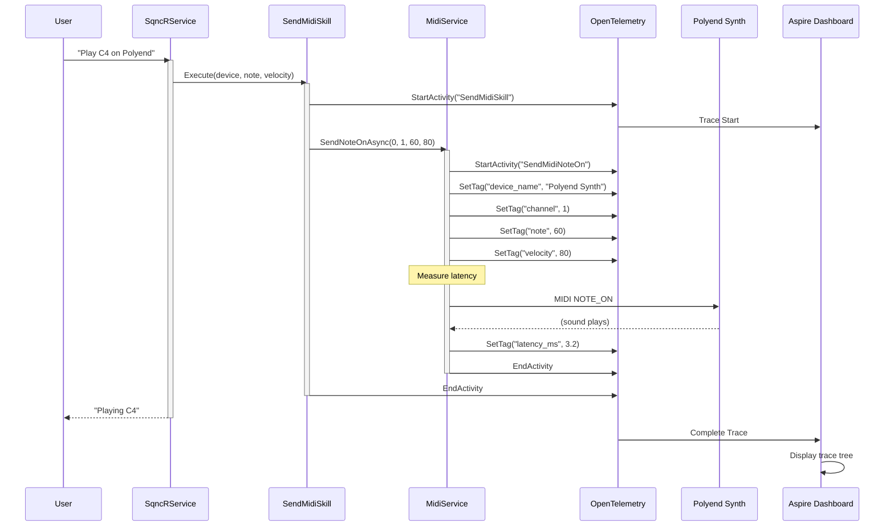

# MIDI Message Flow

**From User Request to Hardware**



## Trace in Aspire Dashboard

```
SendMidiSkill (5.4ms)
  └─ SendMidiNoteOn (3.8ms)
     • device: Polyend Synth MIDI 1
     • channel: 1
     • note: 60 (C4)
     • velocity: 80
     • latency: 3.2ms
```

## Performance Characteristics

- **Target Latency:** < 10ms total
- **Typical Latency:** 3-5ms
- **MIDI I/O Latency:** 2-4ms
- **Observability Overhead:** < 1ms

## Key Features

1. **Full Observability** - Every MIDI message is traced with OpenTelemetry
2. **Precision Tagging** - Device, channel, note, velocity all captured
3. **Latency Measurement** - Precise timing for performance monitoring
4. **Real-time Dashboard** - View in Aspire Dashboard as it happens

---

**See Also:**
- [Telemetry & Observability](telemetry-observability.md)
- [Skill Execution Flow](skill-execution-flow.md)
- [../OBSERVABILITY.md](../OBSERVABILITY.md)
