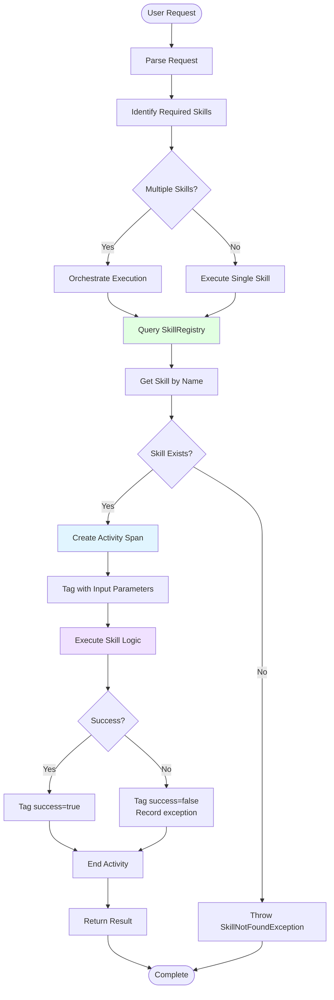

# Skill Execution Flow

**How Skills Are Discovered and Executed**

## Skill Composition Example

```mermaid
flowchart LR
    Request["User: 'ambient drone in Am, darker'"] --> VibeSkill["skill-vibe-to-music"]
    VibeSkill --> ScaleSkill["skill-scale-selector"]
    ScaleSkill --> ChordSkill["skill-chord-progression"]
    ChordSkill --> DeviceSkill["skill-device-selector"]
    DeviceSkill --> SendSkill["skill-send-midi"]
    SendSkill --> Result["Music Playing"]
    
    VibeSkill -.->|"mode: phrygian<br/>brightness: -0.3"| ScaleSkill
    ScaleSkill -.->|"A Phrygian scale"| ChordSkill
    ChordSkill -.->|"Am, Bb, Dm"| DeviceSkill
    DeviceSkill -.->|"Polyend Synth<br/>Channel 1"| SendSkill
    
    style VibeSkill fill:#ffe1e1
    style ScaleSkill fill:#e1ffe1
    style ChordSkill fill:#e1ffe1
    style DeviceSkill fill:#f0e1ff
    style SendSkill fill:#e1f5ff
```

## Skill Execution Principles

1. **Discovery** - Skills are registered at startup and discovered by name
2. **Orchestration** - Complex requests compose multiple skills
3. **Observability** - Every skill execution creates an OpenTelemetry span
4. **Error Handling** - Failures are traced and reported
5. **Composition** - Skills chain outputs to inputs seamlessly

## Skill Categories

- **Musical Intelligence** - Transform concepts to music parameters
- **Device Control** - Interact with MIDI hardware
- **Analysis** - Extract information from music or input
- **Generation** - Create musical patterns algorithmically
- **Transformation** - Modify existing musical data

---

**See Also:**
- [Skill Catalog](../SKILLS.md)
- [MIDI Message Flow](midi-message-flow.md)
- [Agent State Machines](agent-state-machines.md)
