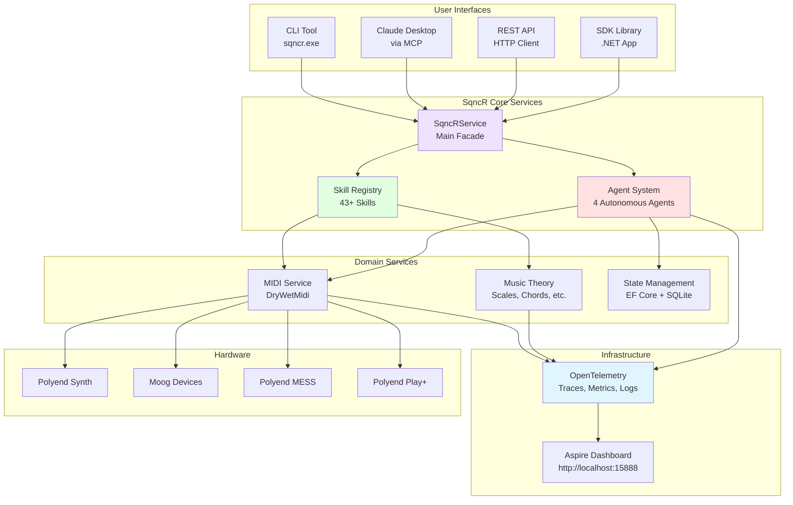

# System Overview Diagram

**High-Level SqncR Architecture**

## Key Components

### User Interfaces (Transport Layer)
- **CLI Tool** - Command-line interface (`sqncr.exe`)
- **Claude Desktop** - Model Context Protocol integration
- **REST API** - HTTP/JSON interface
- **SDK Library** - .NET package for direct integration

### SqncR Core Services
- **SqncRService** - Main facade that coordinates all operations
- **Skill Registry** - 43+ composable music skills
- **Agent System** - 4 autonomous agents for complex workflows

### Domain Services
- **MIDI Service** - Device I/O using DryWetMidi library
- **Theory Service** - Music theory computations
- **State Service** - Session persistence with EF Core + SQLite

### Infrastructure
- **OpenTelemetry** - Distributed tracing, metrics, and logs
- **Aspire Dashboard** - Real-time observability at http://localhost:15888

### Hardware
Supports multiple MIDI devices including Polyend, Moog, and other manufacturers.

---

**See Also:**
- [Transport Layer Architecture](transport-layer.md)
- [MIDI Message Flow](midi-message-flow.md)
- [Device Orchestration](device-orchestration.md)
