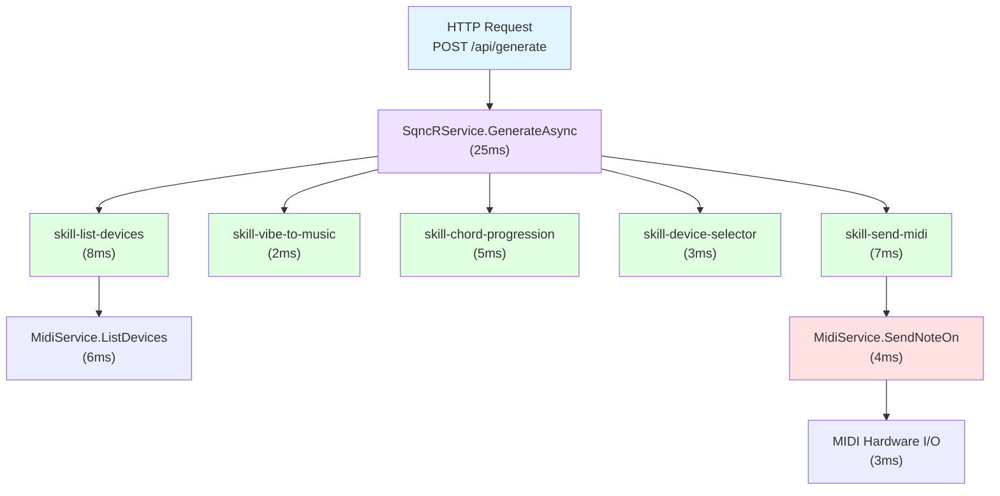
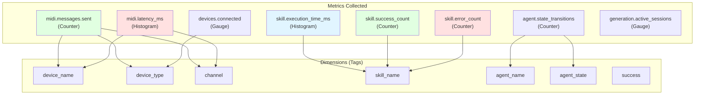

# Telemetry & Observability

## OpenTelemetry Spans Hierarchy



## Aspire Dashboard View

```
Trace: d4f2e1a8-9b3c-4d5e-8f9a-1b2c3d4e5f6a
Duration: 25ms

SqncRService.GenerateAsync (25ms)
├─ skill-list-devices (8ms)
│  └─ MidiService.ListDevices (6ms)
│     • devices_found: 4
│     • scan_time_ms: 5.8
├─ skill-vibe-to-music (2ms)
│  • concept: "darker"
│  • mode: "phrygian"
│  • brightness: -0.3
├─ skill-chord-progression (5ms)
│  • key: "A"
│  • mode: "minor"
│  • chords: ["Am7", "Dm7", "Fmaj7", "E7"]
├─ skill-device-selector (3ms)
│  • role: "bass"
│  • selected: "Moog Mother-32"
│  • reasoning: "Analog warmth perfect for sub-bass"
└─ skill-send-midi (7ms)
   └─ MidiService.SendNoteOn (4ms)
      • device: "Polyend Synth MIDI 1"
      • channel: 1
      • note: 60
      • velocity: 80
      • latency_ms: 3.2
```

## Telemetry Metrics Map



## Key Observability Features

### Distributed Tracing
- ✅ Every request traced from entry to MIDI hardware
- ✅ Skill composition visible in spans
- ✅ MIDI latency measured precisely
- ✅ Agent state transitions tracked

### Metrics
- **Counters**: Messages sent, successes, errors
- **Histograms**: Latency distributions, execution times
- **Gauges**: Active connections, sessions, devices

### Structured Logging
- ✅ Consistent log format across services
- ✅ Correlation IDs for request tracking
- ✅ Contextual data in every log entry
- ✅ Log levels: Debug, Info, Warning, Error

### Dashboard Integration
- ✅ Real-time visualization in Aspire Dashboard
- ✅ Trace timeline view
- ✅ Metrics charts and graphs
- ✅ Log aggregation and filtering

## Performance Targets

| Metric | Target | Typical |
|--------|--------|---------|
| **MIDI Latency** | < 10ms | 3-5ms |
| **Skill Execution** | < 50ms | 10-30ms |
| **Request to Sound** | < 100ms | 40-60ms |
| **Trace Overhead** | < 5% | 2-3% |

---

**See Also:**
- [MIDI Message Flow](midi-message-flow.md)
- [../OBSERVABILITY.md](../OBSERVABILITY.md)
- [Aspire Dashboard Documentation](https://learn.microsoft.com/en-us/dotnet/aspire/fundamentals/dashboard)
