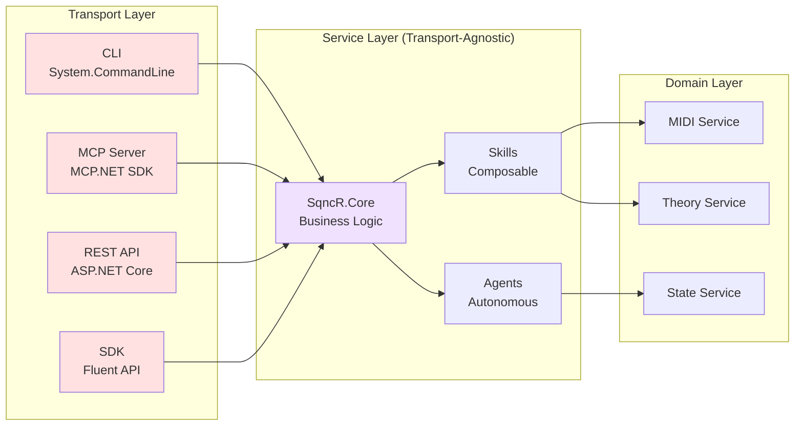

# Transport Layer Architecture

**All Transports Use Same Core**

## Key Insight

**SqncR.Core has ZERO transport dependencies.** 

This means:
- ✅ Add new transports (SSH, gRPC, WebSocket) without changing Core
- ✅ All transports get same functionality automatically
- ✅ Business logic is testable without transport concerns
- ✅ Consistent behavior across all interfaces

## Transport Implementations

### CLI (System.CommandLine)
- Command-line tool for direct shell usage
- Uses `System.CommandLine` library
- Executable: `sqncr.exe`

### MCP Server (MCP.NET SDK)
- Model Context Protocol for AI assistants
- Works with Claude Desktop, GitHub Copilot
- Uses `MCP.NET` SDK

### REST API (ASP.NET Core)
- HTTP/JSON interface for web clients
- OpenAPI/Swagger documentation
- Standard REST conventions

### SDK (.NET Library)
- Fluent API for .NET applications
- Strongly-typed interfaces
- Published as NuGet package

---

**See Also:**
- [System Overview](system-overview.md)
- [Service Layer Details](../ARCHITECTURE.md)
